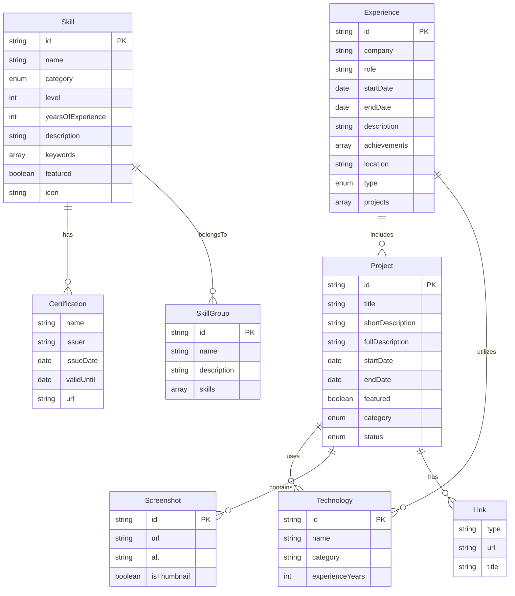

# Portfolio Data Structure

# Data Models

## Overview

This document describes the core data models used in the Portfolio App. These models are designed to represent all the necessary information for a professional portfolio while maintaining clear relationships and constraints.

## Entity Relationship Diagram



## Core Models

### Project

```typescript
export interface Project {
  id: string;
  title: string;
  shortDescription: string;
  fullDescription: string;
  technologies: string[];
  role: string;
  duration: {
    start: string;
    end?: string;
  };
  features: string[];
  links: {
    github?: string;
    live?: string;
    demo?: string;
  };
  images: {
    thumbnail: string;
    screenshots: string[];
  };
  category: ProjectCategory;
  featured: boolean;
  status: ProjectStatus;
}
```

### Skill

```typescript
export interface Skill {
  id: string;
  name: string;
  category: SkillCategory;
  level: number;
  yearsOfExperience: number;
  keywords: string[];
  description?: string;
  certifications?: Certification[];
  featured?: boolean;
  icon?: string;
}
```

### Experience

```typescript
export interface Experience {
  id: string;
  company: string;
  role: string;
  description: string;
  achievements: string[];
  technologies: string[];
  startDate: string;
  endDate?: string;
  location: string;
  type: WorkType;
  projects?: string[];
}
```

## Enums

### ProjectCategory

```typescript
export enum ProjectCategory {
  WEB_DEVELOPMENT = 'Web Development',
  ENTERPRISE = 'Enterprise Software',
  MOBILE = 'Mobile Development',
  DESIGN_SYSTEM = 'Design System'
}
```

### SkillCategory

```typescript
export enum SkillCategory {
  FRONTEND = 'Frontend',
  BACKEND = 'Backend',
  FRAMEWORK = 'Framework',
  LANGUAGE = 'Language',
  DATABASE = 'Database',
  TOOL = 'Tool',
  CLOUD = 'Cloud',
  SOFT = 'Soft Skill',
  METHODOLOGY = 'Methodology'
}
```

### WorkType

```typescript
export enum WorkType {
  REMOTE = 'remote',
  ONSITE = 'onsite',
  HYBRID = 'hybrid'
}
```
