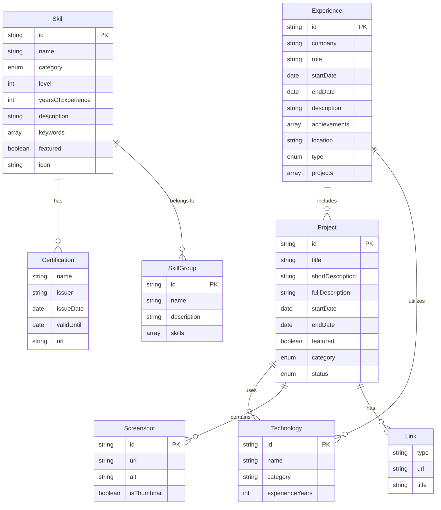

// doc/data-models/data-structure.md

# Portfolio Data Structure

## Entity Relationship Diagram

```mermaid
erDiagram
    Project ||--o{ Technology : uses
    Project ||--o{ Screenshot : contains
    Project ||--o{ Link : has
    Project {
        string id PK
        string title
        string shortDescription
        string fullDescription
        date startDate
        date endDate
        boolean featured
        enum category
        enum status
    }

    Technology {
        string id PK
        string name
        string category
        int experienceYears
    }

    Skill ||--o{ Certification : has
    Skill ||--o{ SkillGroup : belongsTo
    Skill {
        string id PK
        string name
        enum category
        int level
        int yearsOfExperience
        string description
        array keywords
        boolean featured
        string icon
    }

    Certification {
        string name
        string issuer
        date issueDate
        date validUntil
        string url
    }

    SkillGroup {
        string id PK
        string name
        string description
        array skills
    }

    Experience ||--o{ Project : includes
    Experience ||--o{ Technology : utilizes
    Experience {
        string id PK
        string company
        string role
        date startDate
        date endDate
        string description
        array achievements
        string location
        enum type
        array projects
    }

    Screenshot {
        string id PK
        string url
        string alt
        boolean isThumbnail
    }

    Link {
        string type
        string url
        string title
    }
```
