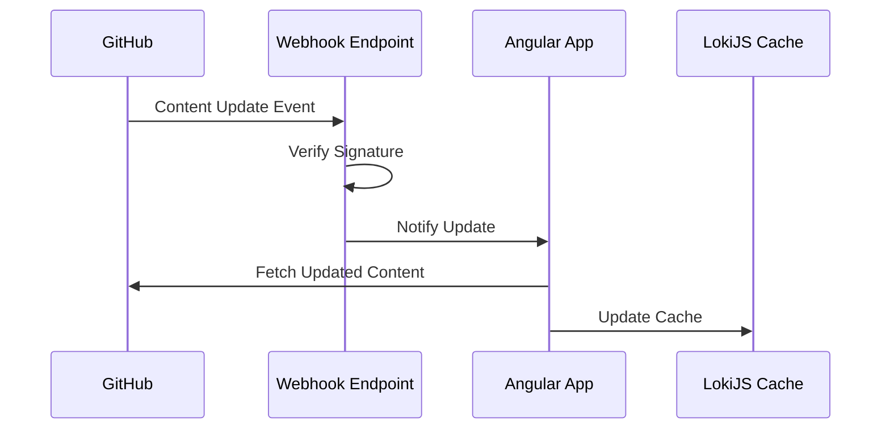

# GitHub Webhooks Integration Guide

## Overview

GitHub Webhooks enable real-time content updates in your portfolio application by notifying your application when content changes occur in the GitHub repository. This guide explains how to set up and handle webhooks for the portfolio CMS.

## Architecture



## Setup

### 1. Create Webhook in GitHub

1. Navigate to your portfolio-content repository
2. Go to Settings > Webhooks > Add webhook
3. Configure webhook:

   ```log
   Payload URL: https://your-api.domain/webhook/github
   Content type: application/json
   Secret: <generate-secure-secret>
   ```

4. Select events:
   - Push
   - Pull request (merged)
   - Content

### 2. Webhook Handler Service

```typescript
// services/webhook-handler.service.ts
import { Injectable } from '@angular/core';
import { HttpClient } from '@angular/common/http';
import { Subject } from 'rxjs';
import * as crypto from 'crypto';

interface WebhookPayload {
  ref: string;
  repository: {
    full_name: string;
  };
  commits?: Array<{
    added: string[];
    modified: string[];
    removed: string[];
  }>;
}

@Injectable({
  providedIn: 'root'
})
export class WebhookHandlerService {
  private webhookSecret = environment.github.webhookSecret;
  private contentUpdated = new Subject<string[]>();
  
  contentUpdated$ = this.contentUpdated.asObservable();

  constructor(private http: HttpClient) {}

  handleWebhook(payload: WebhookPayload, signature: string): boolean {
    if (!this.verifySignature(payload, signature)) {
      console.error('Invalid webhook signature');
      return false;
    }

    const affectedFiles = this.getAffectedFiles(payload);
    if (affectedFiles.length > 0) {
      this.contentUpdated.next(affectedFiles);
    }

    return true;
  }

  private verifySignature(payload: any, signature: string): boolean {
    const hmac = crypto.createHmac('sha256', this.webhookSecret);
    const digest = 'sha256=' + hmac.update(JSON.stringify(payload)).digest('hex');
    return crypto.timingSafeEqual(
      Buffer.from(signature),
      Buffer.from(digest)
    );
  }

  private getAffectedFiles(payload: WebhookPayload): string[] {
    if (!payload.commits) return [];

    const files = new Set<string>();
    payload.commits.forEach(commit => {
      [...commit.added, ...commit.modified, ...commit.removed]
        .filter(file => file.startsWith('data/'))
        .forEach(file => files.add(file));
    });

    return Array.from(files);
  }
}
```

### 3. Content Synchronization Service Update

```typescript
// services/content-sync.service.ts
import { Injectable } from '@angular/core';
import { WebhookHandlerService } from './webhook-handler.service';
import { GitHubCmsService } from './github-cms.service';
import { DatabaseService } from './database.service';

@Injectable({
  providedIn: 'root'
})
export class ContentSyncService {
  constructor(
    private webhookHandler: WebhookHandlerService,
    private githubCms: GitHubCmsService,
    private db: DatabaseService
  ) {
    this.setupWebhookListener();
  }

  private setupWebhookListener() {
    this.webhookHandler.contentUpdated$.pipe(
      switchMap(files => this.updateContent(files))
    ).subscribe();
  }

  private updateContent(files: string[]) {
    return forkJoin(
      files.map(file => this.githubCms.fetchContent(file))
    ).pipe(
      tap(contents => {
        contents.forEach((content, index) => {
          this.db.cacheContent(files[index], content);
        });
      })
    );
  }
}
```

### 4. API Endpoint (Node.js/Express)

```typescript
// server/webhook.controller.ts
import { Request, Response } from 'express';
import { WebhookHandlerService } from '../services/webhook-handler.service';

export class WebhookController {
  constructor(private webhookHandler: WebhookHandlerService) {}

  handleGitHubWebhook(req: Request, res: Response) {
    const signature = req.headers['x-hub-signature-256'];
    
    if (!signature || typeof signature !== 'string') {
      return res.status(401).json({ error: 'Missing signature' });
    }

    if (this.webhookHandler.handleWebhook(req.body, signature)) {
      res.status(200).json({ message: 'Webhook processed successfully' });
    } else {
      res.status(400).json({ error: 'Invalid webhook payload' });
    }
  }
}

// server/app.ts
app.post('/webhook/github', 
  express.json({ verify: (req, res, buf) => { (req as any).rawBody = buf; }}),
  webhookController.handleGitHubWebhook.bind(webhookController)
);
```

## Security Considerations

1. **Webhook Secret:**
   - Use a strong, randomly generated secret
   - Store secret securely in environment variables
   - Rotate secret periodically

2. **Signature Verification:**
   - Always verify webhook signatures
   - Use timing-safe comparison
   - Reject invalid signatures

3. **Rate Limiting:**
   - Implement rate limiting on webhook endpoint
   - Monitor webhook activity
   - Set up alerts for unusual patterns

## Testing

```typescript
describe('WebhookHandlerService', () => {
  let service: WebhookHandlerService;
  let contentUpdated: string[];

  beforeEach(() => {
    TestBed.configureTestingModule({
      providers: [WebhookHandlerService]
    });
    service = TestBed.inject(WebhookHandlerService);
    
    service.contentUpdated$.subscribe(files => {
      contentUpdated = files;
    });
  });

  it('should verify valid signatures', () => {
    const payload = { test: 'data' };
    const signature = generateTestSignature(payload);
    
    expect(service.handleWebhook(payload, signature)).toBe(true);
  });

  it('should notify subscribers of content updates', () => {
    const payload = {
      commits: [{
        added: ['data/projects/new-project.md'],
        modified: ['data/skills/skills.json'],
        removed: []
      }]
    };
    const signature = generateTestSignature(payload);
    
    service.handleWebhook(payload, signature);
    
    expect(contentUpdated).toContain('data/projects/new-project.md');
    expect(contentUpdated).toContain('data/skills/skills.json');
  });
});
```

## Monitoring and Maintenance

1. **Logging:**

   ```typescript
   private logWebhookActivity(payload: WebhookPayload) {
     console.log(`Webhook received from ${payload.repository.full_name}`);
     console.log(`Affected files: ${this.getAffectedFiles(payload)}`);
   }
   ```

2. **Error Handling:**

   ```typescript
   private handleWebhookError(error: Error) {
     console.error('Webhook processing error:', error);
     // Notify monitoring service
     this.monitoring.notifyError('webhook', error);
   }
   ```

3. **Health Checks:**

   ```typescript
   async checkWebhookHealth(): Promise<boolean> {
     try {
       const response = await this.http.get(
         `${environment.github.apiUrl}/repos/${environment.github.owner}/${environment.github.repo}/hooks`
       ).toPromise();
       return response.some(hook => hook.active);
     } catch (error) {
       return false;
     }
   }
   ```

## Troubleshooting

1. **Invalid Signatures:**
   - Verify webhook secret configuration
   - Check payload encoding
   - Ensure raw body is preserved

2. **Missing Updates:**
   - Check webhook delivery logs in GitHub
   - Verify event types are configured correctly
   - Check network connectivity

3. **Performance Issues:**
   - Monitor webhook processing time
   - Implement request queuing if needed
   - Optimize database operations

## Best Practices

1. **Repository Organization:**
   - Keep content in dedicated branches
   - Use meaningful commit messages
   - Implement branch protection rules

2. **Content Updates:**
   - Batch related content changes
   - Use atomic commits
   - Include change descriptions

3. **Error Recovery:**
   - Implement retry mechanisms
   - Store failed webhooks for retry
   - Maintain audit log of changes
