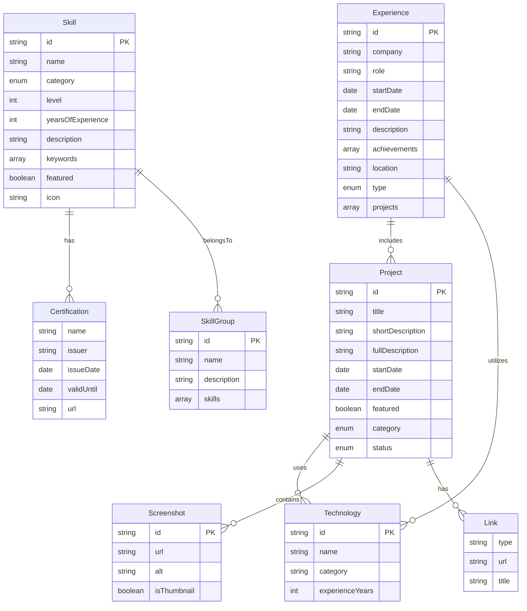
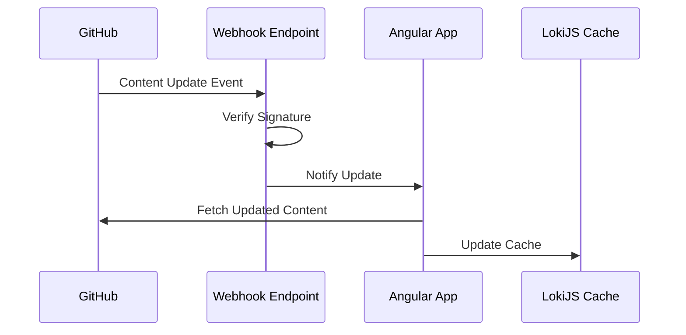

# Portfolio App Repository Snapshot

Generated on: 2024-12-02 03:17:18

## Git Status

Current Branch: `main`

### Last 10 Commits (with full messages)

```
4d15c01
AA fix(data): Fix initial data loading sequence FIX-501: Fix data loading with Promise management - Main changes:   * Fixed Promise.all handling in loadInitialDataFromJson   * Improved data loading sequence with proper Promise grouping   * Added detailed logging for better debugging   * Separated Promise chains by data type
Technical Notes:
- Modified Promise.all implementation to properly wait for all upsert operations
- Grouped operations by data type (projects, skills, experiences)
- Added logging to track data flow
- Improved error handling with detailed error messages

Breaking Changes: None
Documentation: Updated
Migration: N/A

----------------

2a917ca
AA refactor(data): restructure data initialization flow REF-REFACTOR-701: Data Initialization Restructure
- Main changes:
  * Separate production and test data flows
  * Implement proper environment handling
  * Restrict DbTestService to development only
  * Add production data initialization safeguards

Technical Notes:
- Using environment-based configuration
- Added data source validation
- Improved error handling for data initialization

Breaking Changes:
- DbTestService now throws error in production
- Data initialization flow has changed

Documentation: Updated configuration docs
Migration: Required for test environments

----------------

d1d8ea0
AA feat(docs): add GitHub CMS and webhooks documentation REF-DOC-910: CMS Documentation Implementation - Main changes:   * Created comprehensive GitHub CMS setup guide   * Added detailed webhooks integration documentation   * Designed documentation directory structure   * Implemented cross-reference system for CMS documentation   * Added Mermaid diagrams for system visualization   * Created navigation structure for CMS documentation
Technical Notes:
- Organized documentation in /doc/cms/ for better maintainability
- Fixed Mermaid diagram syntax for v10.9.3 compatibility
- Added security considerations for both CMS and webhooks
- Included detailed implementation steps for future reference

Breaking Changes: None

Documentation: Complete
- Added github-cms-guide.md
- Added github-webhooks-guide.md
- Added documentation structure guide
- Updated navigation and cross-references

Migration: N/A

This commit establishes the foundation for our content management system
documentation, providing clear guidelines for both initial setup and ongoing
maintenance. The structured approach ensures scalability as the documentation
grows and makes it easier for team members to find relevant information.

----------------

ddbec71
AA feat(navigation): implement project detail navigation REF-FIX-513: Project Detail Navigation
- Main changes:
  * Fixed inject syntax in ProjectsListComponent
  * Added navigation to project detail
  * Verified initial data loading
  * Added debug logging
  * Added image placeholders for dna-analsys and portfolio

Technical Notes:
- Using modern inject() syntax
- Added effect for data loading debug

Breaking Changes: None
Documentation: N\A
Migration: N/A

----------------

280ba33
AA fix(navigation): implement project detail navigation REF-FIX-513: Project Detail Navigation - Main changes:   * Fixed inject syntax in ProjectsListComponent   * Added navigation to project detail   * Verified initial data loading   * Added debug logging Technical Notes: - Using modern inject() syntax - Added effect for data loading debug Breaking Changes: None Documentation: N\A Migration: N/A

----------------

0962864
AA feat(design): implement theme system and loading states REF-FEAT-512: Theme and Loading Implementation - Main changes:   * Added dark/light theme system   * Implemented loading states for lazy loading   * Added route transition animations   * Fixed SSR compatibility for theme switching   * Enhanced loading performance Technical Notes: - Used CSS variables for theme system - Added transition animations with Angular animations - Optimized SSR theme handling Breaking Changes: None Documentation: Updated theme system documentation Migration: N/A

----------------

5574ac6
AA aggiornamento project diary

----------------

34f0dbd
AA fix(database): complete database service and test implementation REF-FIX-511: Database Service Final Fix - Main changes:   * Added test coverage for initial data loading   * Fixed project interface compliance   * Added missing properties for test data   * Enhanced data validation testing   * Added SSR compatibility tests   * Updated thumbnail image specifications Technical Notes: - Improved error handling and validation - Enhanced SSR compatibility - Added proper test coverage for all critical paths - Fixed project data structure compliance Breaking Changes: None Documentation: Updated data models documentation Migration: N/A

----------------

12c04bb
AA docs(data): add detailed data documentation REF-DOC-904: Data Architecture Documentation - Main changes:   * Created data models documentation   * Added relationships documentation   * Included constraints documentation   * Added ERD diagram and type definitions
Technical Notes:
- Used Mermaid for ERD visualization
- Included TypeScript interfaces
- Added detailed constraints
- Documented all relationships

Breaking Changes: None
Documentation: Added data architecture docs
Migration: N/A

----------------

06876b0
AA docs(readme): update main documentation README REF-DOC-903: Documentation Structure Update - Main changes:   * Added data models section   * Updated project structure   * Added architecture documentation sections   * Improved navigation and organization Technical Notes: - Organized documentation by category - Added clear navigation structure - Included data model references Breaking Changes: None Documentation: Updated main README Migration: N/A

----------------

```

### Working Directory Status

```
On branch main
Your branch is up to date with 'origin/main'.

nothing to commit, working tree clean

```

## Project Files

### Core Configuration

#### angular.json

```json
{
  "$schema": "./node_modules/@angular/cli/lib/config/schema.json",
  "version": 1,
  "newProjectRoot": "projects",
  "projects": {
    "portfolio-app": {
      "projectType": "application",
      "schematics": {
        "@schematics/angular:component": {
          "style": "scss",
          "standalone": true,
          "inlineTemplate": true,
          "inlineStyle": true
        },
        "@schematics/angular:directive": {
          "standalone": true
        },
        "@schematics/angular:pipe": {
          "standalone": true
        }
      },
      "root": "",
      "sourceRoot": "src",
      "prefix": "app",
      "architect": {
        "build": {
          "builder": "@angular-devkit/build-angular:application",
          "options": {
            "outputPath": "dist/portfolio-app",
            "index": "src/index.html",
            "browser": "src/main.ts",
            "server": "src/main.server.ts",
            "polyfills": [
              "zone.js"
            ],
            "tsConfig": "tsconfig.app.json",
            "inlineStyleLanguage": "scss",
            "assets": [
              "src/favicon.ico",
              "src/assets",
              {
                "glob": "**/*",
                "input": "public"
              }
            ],
            "styles": [
              "src/styles.scss"
            ],
            "scripts": [],
            "stylePreprocessorOptions": {
              "includePaths": [
                "src/app/design-system/styles",
                "src",
                "src/styles"
              ]
            },
            "prerender": false, // Disabilitiamo temporaneamente il prerender
            "ssr": {
              "entry": "src/server.ts"
            },
            "allowedCommonJsDependencies": [
              "lokijs"
            ]
          },
          "configurations": {
            "production": {
              "fileReplacements": [
                {
                  "replace": "src/environments/environment.ts",
                  "with": "src/environments/environment.production.ts"
                }
              ],
              "optimization": true,
              "outputHashing": "all",
              "sourceMap": false,
              "namedChunks": false,
              "extractLicenses": true,
              "budgets": [
                {
                  "type": "initial",
                  "maximumWarning": "500kb",
                  "maximumError": "1mb"
                },
                {
                  "type": "anyComponentStyle",
                  "maximumWarning": "4kB",
                  "maximumError": "8kB"
                }
              ],
              "outputHashing": "all"
            },
            "development": {
              "optimization": false,
              "sourceMap": true,
              "extractLicenses": false,
              "namedChunks": true
            }
          },
          "defaultConfiguration": "production"
        },
        "server": {
          "builder": "@angular-devkit/build-angular:server",
          "options": {
            "outputPath": "dist/portfolio-app-server",
            "main": "src/main.server.ts",
            "tsConfig": "tsconfig.server.json"
          }
        },
        "serve": {
          "builder": "@angular-devkit/build-angular:dev-server",
          "configurations": {
            "production": {
              "buildTarget": "portfolio-app:build:production"
            },
            "development": {
              "buildTarget": "portfolio-app:build:development"
            }
          },
          "defaultConfiguration": "development"
        },
         "prerender": {
           "builder": "@angular-devkit/build-angular:prerender",
           "options": {
             "browserTarget": "portfolio-app:build",
             "serverTarget": "portfolio-app:server",
             "routes": [
               "/",
               "/skills",
               "/projects",
               "/experience"
             ]
           }
         },
        "extract-i18n": {
          "builder": "@angular-devkit/build-angular:extract-i18n",
          "options": {
            "buildTarget": "portfolio-app:build"
          }
        },
        "test": {
          "builder": "@angular-devkit/build-angular:karma",
          "options": {
            "polyfills": [
              "zone.js",
              "zone.js/testing"
            ],
            "tsConfig": "tsconfig.spec.json",
            "inlineStyleLanguage": "scss",
            "assets": [
              "src/favicon.ico",
              "src/assets",
              {
                "glob": "**/*",
                "input": "public"
              }
            ],
            "styles": [
              "src/styles.scss"
            ],
            "scripts": []
          }
        }
      }
    }
  },
  "cli": {
    "analytics": "cf026cc1-6a92-46d3-8eaa-1d6d2387a0f4"
  }
}

```

#### doc/cms/schemas/content-schema.json

```json
{
  "$schema": "http://json-schema.org/draft-07/schema#",
  "title": "Portfolio Content Schema",
  "description": "Schema definition for Alessandro Aprile's portfolio content",
  "definitions": {
    "dateString": {
      "type": "string",
      "pattern": "^\\d{4}-\\d{2}(-\\d{2})?$",
      "description": "Date in YYYY-MM or YYYY-MM-DD format"
    },
    "image": {
      "type": "object",
      "required": ["url", "alt"],
      "properties": {
        "url": {
          "type": "string",
          "pattern": "^/assets/images/.+\\.(webp|jpg|png|svg)$"
        },
        "alt": {
          "type": "string",
          "minLength": 5,
          "maxLength": 100
        },
        "caption": {
          "type": "string",
          "maxLength": 200
        }
      }
    },
    "technology": {
      "type": "object",
      "required": ["name", "category"],
      "properties": {
        "name": {
          "type": "string",
          "minLength": 1
        },
        "category": {
          "type": "string",
          "enum": ["frontend", "backend", "database", "devops", "tools", "languages"]
        },
        "proficiency": {
          "type": "integer",
          "minimum": 1,
          "maximum": 5
        }
      }
    }
  },
  "type": "object",
  "required": ["projects", "skills", "experiences"],
  "properties": {
    "projects": {
      "type": "array",
      "items": {
        "type": "object",
        "required": ["id", "title", "description", "technologies", "status"],
        "properties": {
          "id": {
            "type": "string",
            "pattern": "^[a-z0-9-]+$",
            "minLength": 3,
            "maxLength": 50
          },
          "title": {
            "type": "string",
            "minLength": 5,
            "maxLength": 100
          },
          "shortDescription": {
            "type": "string",
            "minLength": 10,
            "maxLength": 200
          },
          "description": {
            "type": "string",
            "minLength": 50,
            "maxLength": 5000
          },
          "technologies": {
            "type": "array",
            "items": {
              "$ref": "#/definitions/technology"
            },
            "minItems": 1
          },
          "images": {
            "type": "object",
            "required": ["thumbnail"],
            "properties": {
              "thumbnail": {
                "$ref": "#/definitions/image"
              },
              "gallery": {
                "type": "array",
                "items": {
                  "$ref": "#/definitions/image"
                },
                "maxItems": 10
              }
            }
          },
          "links": {
            "type": "object",
            "properties": {
              "github": {
                "type": "string",
                "format": "uri"
              },
              "demo": {
                "type": "string",
                "format": "uri"
              },
              "documentation": {
                "type": "string",
                "format": "uri"
              }
            }
          },
          "featured": {
            "type": "boolean",
            "default": false
          },
          "status": {
            "type": "string",
            "enum": ["in-progress", "completed", "archived"]
          },
          "startDate": {
            "$ref": "#/definitions/dateString"
          },
          "endDate": {
            "$ref": "#/definitions/dateString"
          }
        }
      }
    },
    "skills": {
      "type": "array",
      "items": {
        "type": "object",
        "required": ["category", "items"],
        "properties": {
          "category": {
            "type": "string",
            "minLength": 3,
            "maxLength": 50
          },
          "items": {
            "type": "array",
            "items": {
              "$ref": "#/definitions/technology"
            },
            "minItems": 1
          }
        }
      }
    },
    "experiences": {
      "type": "array",
      "items": {
        "type": "object",
        "required": ["company", "role", "startDate", "description"],
        "properties": {
          "company": {
            "type": "string",
            "minLength": 2,
            "maxLength": 100
          },
          "role": {
            "type": "string",
            "minLength": 5,
            "maxLength": 100
          },
          "startDate": {
            "$ref": "#/definitions/dateString"
          },
          "endDate": {
            "$ref": "#/definitions/dateString"
          },
          "current": {
            "type": "boolean",
            "default": false
          },
          "description": {
            "type": "string",
            "minLength": 50,
            "maxLength": 2000
          },
          "technologies": {
            "type": "array",
            "items": {
              "$ref": "#/definitions/technology"
            }
          },
          "highlights": {
            "type": "array",
            "items": {
              "type": "string",
              "minLength": 10,
              "maxLength": 200
            }
          },
          "location": {
            "type": "object",
            "properties": {
              "city": {
                "type": "string"
              },
              "country": {
                "type": "string"
              },
              "remote": {
                "type": "boolean",
                "default": false
              }
            }
          }
        }
      }
    }
  }
}
```

#### package.json

```json
{
  "name": "portfolio-app",
  "version": "0.0.0",
  "scripts": {
    "ng": "ng",
    "start": "ng serve",
    "start:prod": "ng serve --configuration production",
    "build": "ng build",
    "build:dev": "ng build --configuration development",
    "build:prod": "ng build --configuration production",
    "watch": "ng build --watch --configuration development",
    "test": "ng test",
    "lint": "ng lint",
    "dev:ssr": "ng run portfolio-app:serve-ssr",
    "build:ssr": "ng build --configuration production && ng run portfolio-app:server:production",
    "serve:ssr": "node dist/portfolio-app/server/server.mjs",
    "serve:ssr:dev": "SSR=true node dist/portfolio-app/server/server.mjs",
    "prerender": "ng run portfolio-app:prerender"
  },
  "private": true,
  "dependencies": {
    "@angular/animations": "^19.0.0",
    "@angular/cdk": "^19.0.0",
    "@angular/common": "^19.0.0",
    "@angular/compiler": "^19.0.0",
    "@angular/core": "^19.0.0",
    "@angular/forms": "^19.0.0",
    "@angular/material": "^19.0.0",
    "@angular/platform-browser": "^19.0.0",
    "@angular/platform-browser-dynamic": "^19.0.0",
    "@angular/platform-server": "^19.0.0",
    "@angular/router": "^19.0.0",
    "@angular/ssr": "^19.0.1",
    "@fontsource/inter": "^5.1.0",
    "chart.js": "^4.4.6",
    "d3": "^7.9.0",
    "express": "^4.18.2",
    "gun": "^0.2020.1240",
    "lokijs": "^1.5.12",
    "mermaid": "^11.4.0",
    "rimraf": "^6.0.1",
    "rxjs": "~7.8.0",
    "tslib": "^2.3.0",
    "zone.js": "~0.15.0"
  },
  "devDependencies": {
    "@angular-devkit/build-angular": "^19.0.1",
    "@angular-eslint/eslint-plugin": "^18.4.2",
    "@angular-eslint/eslint-plugin-template": "^18.4.2",
    "@angular/cli": "^19.0.1",
    "@angular/compiler-cli": "^19.0.0",
    "@cypress/schematic": "^2.5.2",
    "@types/chart.js": "^2.9.41",
    "@types/d3": "^7.4.3",
    "@types/express": "^5.0.0",
    "@types/jasmine": "~5.1.0",
    "@types/lodash": "^4.17.13",
    "@types/lokijs": "^1.5.14",
    "@types/node": "^22.9.3",
    "@typescript-eslint/eslint-plugin": "^8.15.0",
    "@typescript-eslint/parser": "^8.15.0",
    "cypress": "^13.16.0",
    "eslint-config-prettier": "^9.1.0",
    "glob": "^11.0.0",
    "jasmine-core": "~5.4.0",
    "karma": "^6.4.4",
    "karma-chrome-launcher": "~3.2.0",
    "karma-coverage": "~2.2.0",
    "karma-jasmine": "~5.1.0",
    "karma-jasmine-html-reporter": "~2.1.0",
    "prettier": "^3.3.3",
    "prettier-plugin-organize-imports": "^4.1.0",
    "typescript": "^5.6.3"
  }
}

```

#### src/app/app.config.ts

```ts
import { ApplicationConfig, inject } from '@angular/core';
import { provideRouter } from '@angular/router';
import { provideHttpClient, withFetch } from '@angular/common/http';
import { provideClientHydration } from '@angular/platform-browser';
import { isPlatformBrowser } from '@angular/common';
import { PLATFORM_ID } from '@angular/core';

import { routes } from './app.routes';
import { DatabaseService } from './data-access/services/database.service';
import { PortfolioService } from './data-access/services/portfolio.service';

export const appConfig: ApplicationConfig = {
  providers: [
    provideRouter(routes),
    provideHttpClient(withFetch()),
    {
      provide: 'HYDRATION',
      useFactory: () => {
        const platformId = inject(PLATFORM_ID);
        return isPlatformBrowser(platformId) ? provideClientHydration() : [];
      }
    },
    DatabaseService,
    PortfolioService
  ]
};

```

#### src/assets/data/initial-data.json

```json
{
  "projects": [
    {
      "id": "portfolio-app-2024",
      "title": "Personal Portfolio Website Application",
      "shortDescription": "Modern portfolio website built with Angular and custom design system",
      "fullDescription": "Advanced portfolio website showcasing frontend development expertise. Features include a custom design system, signal-based state management, SSR optimization, and multi-language support. Implements modern Angular 19 features including standalone components, new control flow, and signals for reactive state management.",
      "technologies": [
        "Angular 19",
        "TypeScript 5.5",
        "SCSS",
        "Angular CDK",
        "LokiJS",
        "SSR",
        "i18n"
      ],
      "role": "Full Stack Developer",
      "duration": {
        "start": "2024-11-01"
      },
      "features": [
        "Custom design system with theme support",
        "Signal-based state management",
        "Server-side rendering optimization",
        "Multi-language support (EN, IT, FR)",
        "Comprehensive test coverage"
      ],
      "links": {
        "github": "https://github.com/netalex/portfolio-app",
        "live": "https://alessandroaprile.dev"
      },
      "images": {
        "thumbnail": "/assets/images/projects/portfolio/thumbnail.webp",
        "screenshots": [
          "/assets/images/projects/portfolio/dashboard.webp",
          "/assets/images/projects/portfolio/design-system.webp"
        ]
      },
      "category": "WEB_DEVELOPMENT",
      "featured": true,
      "status": "IN_PROGRESS"
    },
    {
      "id": "dna-analysis-alkemy-2024",
      "title": "DNA Analysis Management System",
      "shortDescription": "System for Italian Ministry of Justice's Joint Forces Command",
      "fullDescription": "Worked on three interconnected projects for the Italian Ministry of Justice's Joint Forces Command, focusing on DNA analysis management systems. Implemented critical change requests, conducted thorough bug fixes, developed new features, and ensured seamless deployment across all projects.",
      "technologies": [
        "Angular",
        "TypeScript",
        "PrimeNG",
        "Git",
        "REST API"
      ],
      "role": "Frontend Developer",
      "duration": {
        "start": "2024-07-01",
        "end": "2024-10-01"
      },
      "features": [
        "Critical change requests implementation",
        "Bug fixes and stability improvements",
        "Feature development",
        "Cross-project integration",
        "Performance optimization"
      ],
      "category": "ENTERPRISE",
      "featured": true,
      "status": "COMPLETED"
    },
    {
      "id": "banking-system-iccrea-2024",
      "title": "Banking Contract Management System",
      "shortDescription": "Internal application for mass CSV upload of loans and mortgages contract data",
      "fullDescription": "Developed and maintained an internal application for ICCREA banking institution that enables mass upload and processing of CSV files containing contractual data for mortgages and loans. Enhanced frontend performance and implemented new features under tight deadlines.",
      "technologies": [
        "Angular",
        "TypeScript",
        "Git",
        "CSV Processing",
        "Banking APIs"
      ],
      "role": "Frontend Developer",
      "duration": {
        "start": "2024-02-01",
        "end": "2024-06-01"
      },
      "features": [
        "Mass CSV data processing",
        "Performance optimization",
        "Git hooks integration",
        "Banking compliance features"
      ],
      "category": "ENTERPRISE",
      "featured": false,
      "status": "COMPLETED"
    }
  ],
  "skills": [
    {
      "id": "angular",
      "name": "Angular",
      "category": "FRAMEWORK",
      "level": 95,
      "yearsOfExperience": 5,
      "keywords": [
        "Angular 19",
        "TypeScript",
        "RxJS",
        "NgRx",
        "Angular Material",
        "PrimeNG",
        "Signals",
        "SSR"
      ],
      "featured": true,
      "icon": "angular"
    },
    {
      "id": "react",
      "name": "React",
      "category": "FRAMEWORK",
      "level": 85,
      "yearsOfExperience": 3,
      "keywords": [
        "Redux",
        "React Native",
        "Hooks",
        "Context API",
        "React Router",
        "Next.js"
      ],
      "featured": true,
      "icon": "react"
    },
    {
      "id": "typescript",
      "name": "TypeScript",
      "category": "LANGUAGE",
      "level": 90,
      "yearsOfExperience": 5,
      "keywords": [
        "ES6+",
        "Type System",
        "Generics",
        "Decorators",
        "Module System"
      ],
      "featured": true,
      "icon": "typescript"
    },
    {
      "id": "frontend",
      "name": "Frontend Development",
      "category": "FRONTEND",
      "level": 95,
      "yearsOfExperience": 10,
      "keywords": [
        "HTML5",
        "CSS3",
        "JavaScript",
        "SCSS",
        "Responsive Design",
        "Web Performance",
        "Browser APIs"
      ],
      "featured": true,
      "icon": "typescript"
    }
  ],
  "experiences": [
    {
      "id": "volo-2024",
      "company": "Volo Consulting/Orangee S.r.l",
      "role": "Frontend Developer",
      "description": "Development of DNA analysis management systems for the Italian Ministry of Justice. Implemented critical features and ensured seamless integration across multiple complex applications.",
      "achievements": [
        "Implemented critical change requests",
        "Improved system stability",
        "Developed new features",
        "Ensured cross-project integration"
      ],
      "technologies": [
        "Angular",
        "TypeScript",
        "PrimeNG",
        "Git",
        "REST API"
      ],
      "startDate": "2024-07-01",
      "endDate": "2024-10-01",
      "location": "Italy",
      "type": "REMOTE"
    },
    {
      "id": "thinkopen-2024",
      "company": "THINKOPEN",
      "role": "Frontend Developer",
      "description": "Worked on multiple high-profile projects including ICCREA banking systems and GFT insurance platforms. Led development teams and mentored junior developers.",
      "achievements": [
        "STUB - please claude compile a pertinent list of achievements"
      ],
      "technologies": [
        "Angular",
        "React",
        "TypeScript",
        "Node.js",
        "Git",
        "Banking APIs"
      ],
      "startDate": "2018-02-01",
      "endDate": "2024-07-01",
      "location": "Milan",
      "type": "hybrid"
    },
    {
      "id": "3wlab-2017",
      "company": "3Wlab Milano/Roma",
      "role": "Frontend Developer",
      "description": "Developed an integrated document management system for the public sector and created AI-powered chatbot solutions.",
      "achievements": [
        "STUB - please claude compile a pertinent list of achievements"
      ],
      "technologies": [
        "AngularJS",
        "JavaScript",
        "Node.js",
        "AI/ML",
        "Document Management"
      ],
      "startDate": "2015-01-01",
      "endDate": "2017-12-31",
      "location": "Milan/Rome",
      "type": "hybrid"
    }
  ],
  "about": {
    "personal": {
      "name": "Alessandro Aprile",
      "title": "Frontend Developer",
      "email": "aprile.alessandro@gmail.com",
      "phone": "+393200625543",
      "location": {
        "country": "Italy",
        "timezone": "CET",
        "workLocations": [
          "Remote",
          "Milan",
          "Rome"
        ]
      },
      "social": {
        "github": "https://github.com/netalex",
        "linkedin": "https://www.linkedin.com/in/alessandro-aprile-0225106/"
      }
    },
    "professionalSummary": {
      "shortBio": "Frontend developer specializing in Angular and React, with extensive experience in enterprise applications and public sector projects.",
      "yearsOfExperience": 10,
      "coreTechnologies": [
        "Angular",
        "React",
        "TypeScript"
      ],
      "focus": [
        "Enterprise Applications",
        "Design Systems",
        "Frontend Architecture"
      ],
      "workingPreferences": {
        "preferred": "Remote",
        "available": [
          "Remote",
          "Hybrid"
        ],
        "locations": [
          "Milan",
          "Rome"
        ]
      }
    },
    "languages": [
      {
        "code": "it",
        "name": "Italian",
        "level": "Native"
      },
      {
        "code": "en",
        "name": "English",
        "level": "Fluent"
      },
      {
        "code": "fr",
        "name": "French",
        "level": "Fluent"
      }
    ]
  }
}

```

#### tsconfig.app.json

```json
/* To learn more about Typescript configuration file: https://www.typescriptlang.org/docs/handbook/tsconfig-json.html. */
/* To learn more about Angular compiler options: https://angular.dev/reference/configs/angular-compiler-options. */
{
  "extends": "./tsconfig.json",
  "compilerOptions": {
    "outDir": "./out-tsc/app",
    "types": [
      "node"
    ]
  },
  "files": [
    "src/main.ts",
    "src/main.server.ts",
    "src/server.ts"
  ],
  "include": [
    "src/**/*.d.ts"
  ]
}

```

#### tsconfig.json

```json
/* To learn more about Typescript configuration file: https://www.typescriptlang.org/docs/handbook/tsconfig-json.html. */
/* To learn more about Angular compiler options: https://angular.dev/reference/configs/angular-compiler-options. */
{
  "compileOnSave": false,
  "compilerOptions": {
    "outDir": "./dist/out-tsc",
    "strict": true,
    "noImplicitOverride": true,
    "noPropertyAccessFromIndexSignature": true,
    "noImplicitReturns": true,
    "noFallthroughCasesInSwitch": true,
    "skipLibCheck": true,
    "isolatedModules": true,
    "esModuleInterop": true,
    "experimentalDecorators": true,
    "moduleResolution": "bundler",
    "importHelpers": true,
    "target": "ES2022",
    "module": "ES2022",
    "lib": [
      "es2022",
      "dom"
    ],
    "types": ["node"],
    "baseUrl": "./",
    "paths": {
      "@environments/*": ["src/environments/*"],
      "@app/*": ["src/app/*"],
    }
  },
  "angularCompilerOptions": {
    "enableI18nLegacyMessageIdFormat": false,
    "strictInjectionParameters": true,
    "strictInputAccessModifiers": true,
    "strictTemplates": true
  }
}

```

#### tsconfig.server.json

```json
{
  "extends": "./tsconfig.app.json",
  "compilerOptions": {
    "outDir": "./dist/out-tsc/server",
    "target": "ES2022",
    "module": "ES2022",
    "moduleResolution": "node",
    "types": ["node"],
    "lib": ["ES2022", "dom"]
  },
  "files": [
    "src/main.server.ts",
    "src/server.ts"
  ]
}

```

#### tsconfig.spec.json

```json
/* To learn more about Typescript configuration file: https://www.typescriptlang.org/docs/handbook/tsconfig-json.html. */
/* To learn more about Angular compiler options: https://angular.dev/reference/configs/angular-compiler-options. */
{
  "extends": "./tsconfig.json",
  "compilerOptions": {
    "outDir": "./out-tsc/spec",
    "types": [
      "jasmine"
    ]
  },
  "include": [
    "src/**/*.spec.ts",
    "src/**/*.d.ts"
  ]
}

```

### Components

#### src/app/app.component.ts

```ts
// src/app/app.component.ts
import { Component, inject, OnInit, PLATFORM_ID } from '@angular/core';
import { RouterOutlet } from '@angular/router';
import { HeaderComponent } from './core/components/header.component';
import { FooterComponent } from './core/components/footer.component';
import { PortfolioService } from './data-access/services/portfolio.service';
import { isPlatformBrowser } from '@angular/common';

@Component({
  selector: 'app-root',
  standalone: true,
  imports: [RouterOutlet, HeaderComponent, FooterComponent],
  template: `
    <div class="app-container">
      <app-header />
      <main class="main-content">
    <router-outlet />
      </main>
      <app-footer />
    </div>
  `,
  styles: [`
    .app-container {
      min-height: 100vh;
      display: flex;
      flex-direction: column;
    }

    .main-content {
      flex: 1;
      margin-top: var(--header-height); // Definiamo questa variabile nel tema
      padding: var(--spacing-4);
      background: var(--background);
    }
  `]
})
export class AppComponent implements OnInit {
  title = 'portfolio-app';
  private readonly portfolioService = inject(PortfolioService);
  private readonly platformId = inject(PLATFORM_ID);

  ngOnInit() {
    // Only load initial data in browser environment
    if (isPlatformBrowser(this.platformId)) {
      this.portfolioService.loadInitialData()
        .catch(error => {
          console.error('Failed to load initial data:', error);
          //TODO: Qui potremmo gestire l'errore in modo più user-friendly
    });
    }
}
}
```

#### src/app/core/components/footer.component.ts

```ts
// src/app/core/components/footer.component.ts
import { Component } from '@angular/core';

@Component({
  selector: 'app-footer',
  standalone: true,
  template: `
    <footer class="app-footer">
      <div class="footer-container">
        <div class="footer-content">
          <div class="footer-info">
            <p>© 2024 Alessandro Aprile. All rights reserved.</p>
          </div>

          <div class="footer-social">
            <a
              href="https://github.com/netalex"
              target="_blank"
              rel="noopener noreferrer"
              class="social-link">
              GitHub
            </a>
            <a
              href="https://www.linkedin.com/in/alessandro-aprile-0225106/"
              target="_blank"
              rel="noopener noreferrer"
              class="social-link">
              LinkedIn
            </a>
          </div>
        </div>
      </div>
    </footer>
  `,
  styles: [`
    .app-footer {
      background: var(--background);
      border-top: 1px solid var(--neutral-200);
      padding: var(--spacing-8) 0;
      margin-top: auto;
    }

    .footer-container {
      max-width: var(--max-width);
      margin: 0 auto;
      padding: 0 var(--spacing-4);
    }

    .footer-content {
      display: flex;
      justify-content: space-between;
      align-items: center;

      @media (max-width: 640px) {
        flex-direction: column;
        gap: var(--spacing-4);
        text-align: center;
      }
    }

    .footer-social {
      display: flex;
      gap: var(--spacing-4);
    }

    .social-link {
      color: var(--foreground);
      text-decoration: none;

      &:hover {
        color: var(--primary);
      }
    }
  `]
})
export class FooterComponent {}
```

#### src/app/core/components/header.component.ts

```ts
// src/app/core/components/header.component.ts
import { Component } from '@angular/core';
import { RouterLink, RouterLinkActive } from '@angular/router';
import { ThemeToggleComponent } from './theme-toggle.component';

@Component({
  selector: 'app-header',
  standalone: true,
  imports: [RouterLink, RouterLinkActive, ThemeToggleComponent],
  template: `
    <header class="app-header">
      <div class="header-container">
        <a routerLink="/" class="logo">
          Alessandro Aprile
        </a>

        <nav class="main-nav">
          <a
            routerLink="/projects"
            routerLinkActive="active"
            class="nav-link">
            Projects
          </a>
          <a
            routerLink="/skills"
            routerLinkActive="active"
            class="nav-link">
            Skills
          </a>
          <a
            routerLink="/experience"
            routerLinkActive="active"
            class="nav-link">
            Experience
          </a>
          <a
            routerLink="/design-system"
            routerLinkActive="active"
            class="nav-link">
            Design System
          </a>
          <app-theme-toggle />
        </nav>
      </div>
    </header>
  `,
  styles: [`
    .app-header {
      background: var(--background);
      border-bottom: 1px solid var(--neutral-200);
      position: fixed;
      top: 0;
      left: 0;
      right: 0;
      z-index: 1000;
    }

    .header-container {
      max-width: var(--max-width);
      margin: 0 auto;
      padding: var(--spacing-4);
      display: flex;
      justify-content: space-between;
      align-items: center;
    }

    .logo {
      font-size: 1.5rem;
      font-weight: 600;
      color: var(--foreground);
      text-decoration: none;

      &:hover {
        color: var(--primary);
      }
    }

    .main-nav {
      display: flex;
      gap: var(--spacing-6);
    }

    .nav-link {
      color: var(--foreground);
      text-decoration: none;
  padding: var(--spacing-2) var(--spacing-4);
  border-radius: var(--radius-md);
  transition: all 0.2s ease;

      &:hover {
        color: var(--primary);
    background: rgba(var(--primary-rgb), 0.1);
      }

      &.active {
        color: var(--primary);
    background: rgba(var(--primary-rgb), 0.15);
    font-weight: 500;
      }
    }
  `]
})
export class HeaderComponent {}

```

#### src/app/core/components/theme-toggle.component.ts

```ts
// src/app/core/components/theme-toggle.component.ts
import { Component, inject } from '@angular/core';
import { ThemeService } from '../services/theme.service';

@Component({
  selector: 'app-theme-toggle',
  standalone: true,
  template: `
    <button
      class="theme-toggle"
      (click)="themeService.toggleTheme()"
      [attr.aria-label]="'Toggle ' + (themeService.theme() === 'dark' ? 'light' : 'dark') + ' theme'"
    >
      @if (themeService.theme() === 'light') {
        <svg xmlns="http://www.w3.org/2000/svg" width="24" height="24" viewBox="0 0 24 24" fill="none" stroke="currentColor" stroke-width="2" stroke-linecap="round" stroke-linejoin="round">
          <path d="M21 12.79A9 9 0 1 1 11.21 3 7 7 0 0 0 21 12.79z"></path>
        </svg>
      } @else {
        <svg xmlns="http://www.w3.org/2000/svg" width="24" height="24" viewBox="0 0 24 24" fill="none" stroke="currentColor" stroke-width="2" stroke-linecap="round" stroke-linejoin="round">
          <circle cx="12" cy="12" r="5"></circle>
          <line x1="12" y1="1" x2="12" y2="3"></line>
          <line x1="12" y1="21" x2="12" y2="23"></line>
          <line x1="4.22" y1="4.22" x2="5.64" y2="5.64"></line>
          <line x1="18.36" y1="18.36" x2="19.78" y2="19.78"></line>
          <line x1="1" y1="12" x2="3" y2="12"></line>
          <line x1="21" y1="12" x2="23" y2="12"></line>
          <line x1="4.22" y1="19.78" x2="5.64" y2="18.36"></line>
          <line x1="18.36" y1="5.64" x2="19.78" y2="4.22"></line>
        </svg>
      }
    </button>
  `,
  styles: [`
    .theme-toggle {
      background: none;
      border: none;
      padding: var(--spacing-2);
      cursor: pointer;
      color: var(--foreground);
      border-radius: var(--radius-full);
      transition: all 0.2s ease;

      &:hover {
        background: rgba(var(--foreground-rgb), 0.1);
      }

      svg {
        display: block;
        width: 20px;
        height: 20px;
      }
    }
  `]
})
export class ThemeToggleComponent {
  protected readonly themeService = inject(ThemeService);
}
```

#### src/app/features/design-system/design-system.component.ts

```ts
// src/app/features/design-system/design-system.component.ts
import { AfterViewInit, Component } from '@angular/core';
import { ActivatedRoute, Router, RouterLink, RouterLinkActive } from '@angular/router';


interface ColorToken {
  name: string;
  value: string;
  cssVar: string;
  hex?: string;
  rgb?: string;
}

interface TypographyToken {
  name: string;
  class: string;
  text: string;
  cssClass: string;
  description: string;
}

interface SpacingToken {
  name: string;
  value: string;
  cssVar: string;
  pxValue?: number;
}

@Component({
  selector: 'app-design-system',
  standalone: true,
  imports: [RouterLink, RouterLinkActive],
  template: `
    <div class="design-system-container">
      <header class="design-system-header">
        <h1>Design System</h1>
        <p>A collection of reusable components and design tokens</p>

        <nav class="ds-nav">
          <a [routerLink]="[]" [fragment]="'colors'" routerLinkActive="active">Colors</a>
          <a [routerLink]="[]" [fragment]="'typography'" routerLinkActive="active">Typography</a>
          <a [routerLink]="[]" [fragment]="'spacing'" routerLinkActive="active">Spacing</a>
          <a [routerLink]="[]" [fragment]="'components'" routerLinkActive="active">Components</a>
        </nav>
      </header>

      <section id="colors" class="section">
        <h2>Colors</h2>
        <div class="color-grid">
          @for (color of colors; track color.name) {
            <div class="color-card">
              <div class="color-sample" [style.background-color]="color.value"></div>
              <div class="color-info">
                <h3>{{ color.name }}</h3>
                <code>{{ color.cssVar }}</code>
                @if (color.hex) {
                  <p class="color-hex">{{ color.hex }}</p>
                }
              </div>
            </div>
          }
        </div>
        <a (click)="scrollToTop()" class="back-to-top">↑</a>
      </section>

      <section id="typography" class="section">
        <h2>Typography</h2>
        <div class="typography-samples">
          @for (sample of typographySamples; track sample.name) {
            <div class="type-sample">
              <div [class]="sample.class">{{ sample.text }}</div>
              <div class="type-info">
                <code>{{ sample.cssClass }}</code>
                <span>{{ sample.description }}</span>
              </div>
            </div>
          }
        </div>
        <a (click)="scrollToTop()" class="back-to-top">↑</a>
      </section>

      <section id="spacing" class="section">
        <h2>Spacing</h2>
        <div class="spacing-samples">
          @for (space of spacing; track space.name) {
            <div class="spacing-item">
              <div class="spacing-box" [style.width]="space.value"></div>
              <div class="spacing-info">
                <code>{{ space.cssVar }}</code>
                <span>{{ space.value }}</span>
              </div>
            </div>
          }
        </div>
        <a (click)="scrollToTop()" class="back-to-top">↑</a>
      </section>

      <section id="components" class="section">
        <h2>Components</h2>
        <!-- Component demos to be added -->
      </section>
      <a (click)="scrollToTop()" class="back-to-top">↑</a>
    </div>
  `,
  styles: [
    `
      .design-system-container {
        padding: var(--spacing-6);
        max-width: 1200px;
        margin: 0 auto;
      }

      .design-system-header {
        margin-bottom: var(--spacing-8);
        text-align: center;
      }

      .ds-nav {
        display: flex;
        justify-content: center;
        gap: var(--spacing-4);
        margin-top: var(--spacing-8);
        padding-bottom: var(--spacing-4);
        border-bottom: 1px solid var(--neutral-200);

        a {
          color: var(--text);
          text-decoration: none;
          padding: var(--spacing-2) var(--spacing-4);
          border-radius: var(--radius-md);
          transition: all 0.2s ease;
          cursor: pointer; // Aggiunto per migliorare UX

          &:hover {
            background: var(--neutral-100);
          }

          &.active {
            color: var(--primary);
            background: rgba(var(--primary-rgb), 0.1);
            font-weight: 500;
          }
        }
      }

      .section {
        scroll-margin-top: 2rem; // Aggiunto per migliorare lo scroll to anchor
        margin-bottom: var(--spacing-16);

        h2 {
          margin-bottom: var(--spacing-8);
          padding-bottom: var(--spacing-4);
          border-bottom: 1px solid var(--neutral-200);
        }
      }

      .color-grid {
        display: grid;
        grid-template-columns: repeat(auto-fill, minmax(200px, 1fr));
        gap: var(--spacing-6);
        margin-bottom: var(--spacing-8);
      }

      .color-card {
        background: var(--surface);
        border-radius: var(--radius-lg);
        overflow: hidden;
        box-shadow: var(--shadow-sm);
      }

      .color-sample {
        height: 120px;
        transition: transform 0.2s ease;
        cursor: pointer;

        &:hover {
          transform: scale(1.02);
        }
      }

      .color-info {
        padding: var(--spacing-4);

        h3 {
          margin: 0 0 var(--spacing-2);
          font-size: var(--font-size-lg);
        }

        code {
          display: block;
          font-family: var(--font-mono);
          font-size: var(--font-size-sm);
          color: var(--text-secondary);
          margin-bottom: var(--spacing-2);
        }

        .color-hex {
          font-family: var(--font-mono);
          font-size: var(--font-size-sm);
          color: var(--text-secondary);
        }
      }

      .typography-samples {
        display: flex;
        flex-direction: column;
        gap: var(--spacing-8);
      }

      .type-sample {
        border-bottom: 1px solid var(--neutral-200);
        padding-bottom: var(--spacing-6);

        &:last-child {
          border-bottom: none;
        }
      }

      .type-info {
        display: flex;
        gap: var(--spacing-4);
        margin-top: var(--spacing-2);
        font-size: var(--font-size-sm);
        color: var(--text-secondary);

        code {
          font-family: var(--font-mono);
          background: var(--neutral-100);
          padding: var(--spacing-1) var(--spacing-2);
          border-radius: var(--radius-sm);
        }
      }

      .heading-1 {
        font-size: var(--font-size-4xl);
        font-weight: 700;
        line-height: 1.2;
      }

      .heading-2 {
        font-size: var(--font-size-3xl);
        font-weight: 600;
        line-height: 1.25;
      }

      .body {
        font-size: var(--font-size-base);
        line-height: 1.5;
      }

      .small {
        font-size: var(--font-size-sm);
        line-height: 1.4;
      }

      .spacing-samples {
        display: flex;
        flex-direction: column;
        gap: var(--spacing-4);
      }

      .spacing-item {
        display: flex;
        align-items: center;
        gap: var(--spacing-4);
      }

      .spacing-box {
        height: 24px;
        background: var(--primary);
        border-radius: var(--radius-sm);
        transition: width 0.3s ease;
      }

      .spacing-info {
        display: flex;
        gap: var(--spacing-4);
        font-size: var(--font-size-sm);

        code {
          font-family: var(--font-mono);
          background: var(--neutral-100);
          padding: var(--spacing-1) var(--spacing-2);
          border-radius: var(--radius-sm);
        }
      }

      .back-to-top {
        display: block;
        text-align: center;
        margin-top: var(--spacing-8);
        padding: var(--spacing-2) var(--spacing-4);
        color: var(--primary);
        text-decoration: none;
        cursor: pointer;
        transition: all 0.2s ease;
        font-weight: 500;

        &:hover {
          transform: translateY(-2px);
          color: var(--primary-dark);
        }

        &::after {
          content: '';
          display: block;
          width: 40px;
          height: 2px;
          background: var(--primary);
          margin: var(--spacing-2) auto 0;
          transition: width 0.2s ease;
        }

        &:hover::after {
          width: 60px;
        }
      }
    `,
  ],
})
export class DesignSystemComponent implements AfterViewInit {
  constructor(
    private readonly route: ActivatedRoute,
    private readonly router: Router
  ) {}

  ngAfterViewInit() {
    // Gestione dell'ancoraggio iniziale
    this.route.fragment.subscribe(fragment => {
      if (fragment) {
        const element = document.getElementById(fragment);
        if (element) {
          element.scrollIntoView({ behavior: 'smooth' });
        }
      }
    });
  }

  scrollToTop(): void {
    window.scrollTo({
      top: 0,
      behavior: 'smooth'
    });
  }


  colors: ColorToken[] = [
    {
      name: 'Primary',
      value: 'var(--primary)',
      cssVar: '--primary',
      hex: '#3498db',
      rgb: '52, 152, 219',
    },
    {
      name: 'Secondary',
      value: 'var(--secondary)',
      cssVar: '--secondary',
      hex: '#2c3e50',
      rgb: '44, 62, 80',
    },
    {
      name: 'Surface',
      value: 'var(--surface)',
      cssVar: '--surface',
      hex: '#ffffff',
      rgb: '255, 255, 255',
    },
    {
      name: 'Text',
      value: 'var(--text)',
      cssVar: '--text',
      hex: '#2c3e50',
      rgb: '44, 62, 80',
    },
  ];

  typographySamples: TypographyToken[] = [
    {
      name: 'Heading 1',
      class: 'heading-1',
      text: 'The quick brown fox jumps over the lazy dog',
      cssClass: '.heading-1',
      description: 'Main page headings',
    },
    {
      name: 'Heading 2',
      class: 'heading-2',
      text: 'The quick brown fox jumps over the lazy dog',
      cssClass: '.heading-2',
      description: 'Section headings',
    },
    {
      name: 'Body',
      class: 'body-text',
      text: 'The quick brown fox jumps over the lazy dog',
      cssClass: '.body',
      description: 'Regular body text',
    },
    {
      name: 'Small',
      class: 'text-small',
      text: 'The quick brown fox jumps over the lazy dog',
      cssClass: '.small',
      description: 'Small text and captions',
    },
  ];

  spacing: SpacingToken[] = [
    {
      name: 'Extra Small',
      value: '0.5rem',
      cssVar: '--spacing-2',
      pxValue: 8,
    },
    {
      name: 'Small',
      value: '1rem',
      cssVar: '--spacing-4',
      pxValue: 16,
    },
    {
      name: 'Medium',
      value: '1.5rem',
      cssVar: '--spacing-6',
      pxValue: 24,
    },
    {
      name: 'Large',
      value: '2rem',
      cssVar: '--spacing-8',
      pxValue: 32,
    },
  ];
}

```

#### src/app/features/experience/experience-list.component.ts

```ts
// src/app/features/experience/experience-list.component.ts
import { Component, inject } from '@angular/core';
import { PortfolioStore } from '../../data-access/store/portfolio.store';

@Component({
  selector: 'app-experience-list',
  standalone: true,
  template: `
    <div class="experience-container">
      @if (loading()) {
        <div class="loading">Loading experiences...</div>
      }

      @if (error()) {
        <div class="error">{{ error() }}</div>
      }

      @if (experiences().length) {
        <div class="experience-timeline">
          @for (experience of experiences(); track experience.id) {
            <div class="experience-card">
              <div class="experience-period">
                {{ formatDate(experience.startDate) }} -
                {{ experience.endDate ? formatDate(experience.endDate) : 'Present' }}
              </div>
              <div class="experience-content">
                <h3>{{ experience.company }}</h3>
                <h4>{{ experience.role }}</h4>
                <p>{{ experience.description }}</p>
                <div class="experience-technologies">
                  @for (tech of experience.technologies; track tech) {
                    <span class="tech-badge">{{ tech }}</span>
                  }
                </div>
              </div>
            </div>
          }
        </div>
      }
    </div>
  `,
  styles: [`
    .experience-container {
      padding: var(--spacing-4);
      max-width: 800px;
      margin: 0 auto;
    }

    .experience-timeline {
      position: relative;
      padding-left: var(--spacing-8);
    }

    .experience-timeline::before {
      content: '';
      position: absolute;
      left: 0;
      top: 0;
      bottom: 0;
      width: 2px;
      background: var(--primary);
    }

    .experience-card {
      position: relative;
      margin-bottom: var(--spacing-6);
      padding-left: var(--spacing-4);
    }

    .experience-card::before {
      content: '';
      position: absolute;
      left: -6px;
      top: 0;
      width: 12px;
      height: 12px;
      border-radius: 50%;
      background: var(--primary);
    }

    .experience-period {
      font-size: 0.9em;
      color: var(--text-secondary);
      margin-bottom: var(--spacing-2);
    }

    .experience-content {
      background: var(--surface);
      padding: var(--spacing-4);
      border-radius: var(--radius-md);
      box-shadow: var(--shadow-sm);
    }

    .experience-technologies {
      display: flex;
      flex-wrap: wrap;
      gap: var(--spacing-2);
      margin-top: var(--spacing-3);
    }

    .tech-badge {
      padding: var(--spacing-1) var(--spacing-2);
      background: var(--surface-variant);
      border-radius: var(--radius-sm);
      font-size: 0.8em;
    }
  `]
})
export class ExperienceListComponent {
  private readonly store = inject(PortfolioStore);

  experiences = this.store.sortedExperiences;
  loading = this.store.loading;
  error = this.store.error;

  formatDate(dateStr: string): string {
    const date = new Date(dateStr);
    return date.toLocaleDateString('en-US', {
      month: 'short',
      year: 'numeric'
    });
  }
}

```

#### src/app/features/home/home.component.ts

```ts
import { Component, inject, OnInit } from '@angular/core';
import { RouterLink } from '@angular/router';
import { PortfolioStore } from '../../data-access/store/portfolio.store';
import { Meta, Title } from '@angular/platform-browser';
import { DbTestService } from '../../data-access/services/db-test.service';
import { ConfigService } from '../../core/services/config.service';

@Component({
  selector: 'app-home',
  standalone: true,
  imports: [RouterLink],
  template: `
  <div class="home-container">
      <section class="hero">
      <div class="hero-content">
        <h1 class="name">Alessandro Aprile</h1>
        <h2 class="role">Frontend Developer</h2>
        <p class="tagline">Specializzato in Angular, React e architetture frontend moderne</p>

        <div class="hero-actions">
          <a routerLink="/projects" class="hero-btn primary">
            Vedi Progetti
          </a>
          <a routerLink="/experience" class="hero-btn secondary">
            Esperienza
          </a>
        </div>
      </div>
      <p>config.isProduction è {{config.isProduction}}<p>
        @if (config.features.enableDevTools && !config.isProduction) {
          <div class="dev-tools">
            <button
              (click)="testDb()"
              [disabled]="isTestingDb"
              class="test-button"
            >
              {{ isTestingDb ? 'Testing...' : 'Test Database' }}
            </button>
            @if (lastTestResult) {
              <div class="test-result" [class.success]="lastTestResult.success">
                <h4>Last Test Result:</h4>
                @if (lastTestResult.success) {
                  <p>Success! Items in DB:</p>
                  <ul>
                    <li>Projects: {{ lastTestResult.counts?.projects }}</li>
                    <li>Skills: {{ lastTestResult.counts?.skills }}</li>
                    <li>Experiences: {{ lastTestResult.counts?.experiences }}</li>
                  </ul>
                } @else {
                  <p class="error">Error: {{ lastTestResult.error }}</p>
                }
              </div>
            }
          </div>
        }
      </section>

    <section class="featured-projects">
      <h3>Featured Projects</h3>
      @for (project of featuredProjects(); track project.id) {
        <div class="project-card">
          <h4>{{ project.title }}</h4>
          <p>{{ project.shortDescription }}</p>
        </div>
      }
    </section>
    </div>
  `,
  styles: [`
    .hero {
      background: linear-gradient(
        135deg,
        var(--background) 0%,
        rgba(var(--primary-rgb), 0.1) 100%
      );
      padding: var(--spacing-16) var(--spacing-4);
      text-align: center;
      margin-bottom: var(--spacing-16);
      position: relative;
    z-index: 1;

    a {
      pointer-events: all;
    }

    }

    .hero-content {
      max-width: 800px;
      margin: 0 auto;
    }

    .name {
      font-size: 3.5rem;
      font-weight: 700;
      margin-bottom: var(--spacing-4);
      background: linear-gradient(
        45deg,
        var(--primary) 0%,
        var(--primary-light) 100%
      );
      -webkit-background-clip: text;
      -webkit-text-fill-color: transparent;
    }

    .role {
      font-size: 2rem;
      color: var(--foreground);
      margin-bottom: var(--spacing-6);
    }

    .tagline {
      font-size: 1.25rem;
      color: var(--text-secondary);
      margin-bottom: var(--spacing-8);
      line-height: 1.6;
    }

    .hero-actions {
      display: flex;
      gap: var(--spacing-4);
      justify-content: center;
    position: relative;
    z-index: 2;  // Assicuriamoci che sia sopra eventuali altri elementi
    }

    .hero-btn {
    display: inline-block;
      padding: var(--spacing-3) var(--spacing-6);
      border-radius: var(--radius-md);
      text-decoration: none;
      font-weight: 500;
      transition: all 0.2s ease;
    position: relative;
    z-index: 2;
    pointer-events: all;  // Forza la clickability
    cursor: pointer;      // Rende esplicito che è cliccabile

      &.primary {
        background: var(--primary);
        color: white;
      border: 2px solid var(--primary);

        &:hover {
        background: white;
        color: var(--primary);  // Testo diventa blu
          transform: translateY(-2px);
        }
      }

      &.secondary {
      background: white;
        color: var(--primary);
      border: 2px solid var(--primary);

        &:hover {
        background: var(--primary);
        color: white;  // Testo diventa bianco
          transform: translateY(-2px);
        }
      }
    }

    .dev-tools {
      margin-top: 2rem;
      padding: 1rem;
      border: 1px solid #ddd;
      border-radius: 4px;
      background: var(--surface);
      color: var(--text);
    }

    .test-button {
      padding: 0.5rem 1rem;
      background: var(--primary);
      color: white;
      border: none;
      border-radius: 4px;
      cursor: pointer;

      &:disabled {
        opacity: 0.7;
        cursor: not-allowed;
      }
    }

    .test-result {
      margin-top: 1rem;
      padding: 1rem;
      border-radius: 4px;
      background: var(--surface);
      color: var(--text);

      &.success {
        border-left: 4px solid var(--color-success);
      }

      &:not(.success) {
        border-left: 4px solid var(--color-error);
      }

      h4 {
        color: var(--text);      // Assicurati che i titoli abbiano il colore corretto
        margin-bottom: 0.5rem;
      }

      ul {
        list-style: none;
        padding-left: 1rem;
        color: var(--text);      // Assicurati che le liste abbiano il colore corretto
      }
    }

    .error {
      color: var(--color-error);
    }
    .home-container {
      padding: var(--spacing-4);
    }

    .hero {
      text-align: center;
      padding: 4rem 2rem;
      background: var(--gradient-primary);
    }

    .featured-projects {
      padding: 2rem;
    }
  `]
})
export class HomeComponent implements OnInit {
  private readonly dbTest = inject(DbTestService);
  protected readonly config = inject(ConfigService);
  protected isTestingDb = false;
  protected lastTestResult: any = null;

  private readonly store = inject(PortfolioStore);
  private readonly meta = inject(Meta);
  private readonly title = inject(Title);

  constructor() {
    this.title.setTitle('Alessandro Aprile - Frontend Developer');
    this.meta.updateTag({
      name: 'description',
      content: 'Portfolio of Alessandro Aprile, Frontend Developer specialized in Angular, React, and modern web technologies.'
    });
  }

  async ngOnInit() {
    if (!this.config.isProduction) {
      console.log("is development")
    }
    console.log('Current environment:', {
      api: this.config.apiConfig,
      features: this.config.features,
      i18n: this.config.i18nConfig,
      github: this.config.github
    });
    console.log('current store', this.storeTest)
  }

  async testDb() {
    if (this.config.isProduction) {
      console.warn('Database testing is not available in production mode');
      return;
    }

    this.isTestingDb = true;
    try {
      this.lastTestResult = await this.dbTest.testDatabaseOperations();
    } catch (error) {
      this.lastTestResult = {
        success: false,
        error: error instanceof Error ? error.message : 'Unknown error'
      };
    } finally {
      this.isTestingDb = false;
    }
  }

  featuredProjects = this.store.featuredProjects;
  storeTest = this.store;
}

```

#### src/app/features/not-found/not-found.component.ts

```ts
// src/app/features/not-found/not-found.component.ts
import { Component } from '@angular/core';
import { RouterLink } from '@angular/router';

@Component({
  selector: 'app-not-found',
  standalone: true,
  imports: [RouterLink],
  template: `
    <div class="not-found-container">
      <div class="not-found-content">
        <h1>404</h1>
        <h2>Page Not Found</h2>
        <p>The page you're looking for doesn't exist or has been moved.</p>
        <a routerLink="/" class="home-link">Go to Homepage</a>
      </div>
    </div>
  `,
  styles: [`
    .not-found-container {
      height: 100vh;
      display: flex;
      align-items: center;
      justify-content: center;
      text-align: center;
      padding: var(--spacing-4);
    }

    .not-found-content {
      max-width: 500px;
    }

    h1 {
      font-size: 6rem;
      color: var(--primary);
      margin: 0;
    }

    h2 {
      margin: var(--spacing-4) 0;
    }

    .home-link {
      display: inline-block;
      margin-top: var(--spacing-4);
      padding: var(--spacing-2) var(--spacing-4);
      background-color: var(--primary);
      color: white;
      text-decoration: none;
      border-radius: var(--radius-md);
      transition: background-color 0.3s ease;

      &:hover {
        background-color: var(--primary-dark);
      }
    }
  `]
})
export class NotFoundComponent {}
```

#### src/app/features/projects/components/project-card.component.ts

```ts
// src/app/features/projects/components/project-card.component.ts
import { Component, Input, Output, EventEmitter } from '@angular/core';
import { Project } from '../../../data-access/models/portfolio.models';

@Component({
  selector: 'app-project-card',
  standalone: true,
  template: `
    <article
      class="project-card"
      [class.featured]="project.featured"
      (click)="onProjectClick()"
    >
      @if (project.images?.thumbnail) {
        
      }

      <div class="project-content">
        <h3 class="project-title">{{ project.title }}</h3>
        <p class="project-description">{{ project.shortDescription }}</p>

        <div class="project-technologies">
          @for (tech of project.technologies; track tech) {
            <span class="tech-badge">{{ tech }}</span>
          }
        </div>

        <div class="project-links">
          @if (project.links?.demo) {
            <a
              [href]="project.links.demo"
              target="_blank"
              rel="noopener noreferrer"
              class="project-link demo"
            >
              Demo
            </a>
          }
          @if (project.links?.github) {
            <a
              [href]="project.links.github"
              target="_blank"
              rel="noopener noreferrer"
              class="project-link source"
            >
              Source
            </a>
          }
        </div>
      </div>
    </article>
  `,
  styles: [`
    .project-card {
      background: var(--surface);
      border-radius: var(--radius-lg);
      overflow: hidden;
      box-shadow: var(--shadow-sm);
      transition: transform 0.2s, box-shadow 0.2s;
      cursor: pointer;

      &:hover {
        transform: translateY(-4px);
        box-shadow: var(--shadow-md);
      }

      &.featured {
        border: 2px solid var(--primary);
      }
    }

    .project-image {
      width: 100%;
      height: 200px;
      object-fit: cover;
    }

    .project-content {
      padding: var(--spacing-4);
    }

    .project-title {
      font-size: var(--font-size-xl);
      color: var(--foreground);
      margin-bottom: var(--spacing-2);
    }

    .project-description {
      color: var(--text-secondary);
      margin-bottom: var(--spacing-4);
      line-height: 1.5;
    }

    .project-technologies {
      display: flex;
      flex-wrap: wrap;
      gap: var(--spacing-2);
      margin-bottom: var(--spacing-4);
    }

    .tech-badge {
      background: var(--surface-variant);
      color: var(--foreground);
      padding: var(--spacing-1) var(--spacing-2);
      border-radius: var(--radius-full);
      font-size: var(--font-size-sm);
    }

    .project-links {
      display: flex;
      gap: var(--spacing-3);
    }

    .project-link {
      padding: var(--spacing-2) var(--spacing-4);
      border-radius: var(--radius-md);
      text-decoration: none;
      font-weight: 500;
      transition: background-color 0.2s;

      &.demo {
        background: var(--primary);
        color: var(--primary-foreground);

        &:hover {
          background: var(--primary-hover);
        }
      }

      &.source {
        background: var(--surface-variant);
        color: var(--foreground);

        &:hover {
          background: var(--surface-variant-hover);
        }
      }
    }
  `]
})
export class ProjectCardComponent {
  @Input({ required: true }) project!: Project;
  @Output() projectClick = new EventEmitter<string>();

  onProjectClick() {
    this.projectClick.emit(this.project.id);
  }
}

```

#### src/app/features/projects/components/project-filters.component.ts

```ts
// features/projects/project-filters.component.ts
import { Component, EventEmitter, Input, Output, signal } from '@angular/core';

export interface ProjectFilters {
  technology?: string;
  // Predisponiamo l'interfaccia per filtri futuri
  status?: 'all' | 'completed' | 'in-progress';
  year?: number;
}

@Component({
  selector: 'app-project-filters',
  standalone: true,
  template: `
    <div class="filters-container">
      <div class="filters-row">
        <div class="filter-group">
          <label for="tech-filter" class="filter-label">Tecnologia</label>
          <div class="filter-chips">
            <button
              class="filter-chip"
              [class.active]="!selectedTechnology()"
              (click)="clearTechnologyFilter()"
            >
              Tutte
            </button>
            @for (tech of technologies; track tech) {
              <button
                class="filter-chip"
                [class.active]="selectedTechnology() === tech"
                (click)="selectTechnology(tech)"
              >
                {{ tech }}
              </button>
            }
          </div>
        </div>

        <div class="active-filters" role="status" aria-live="polite">
          @if (selectedTechnology()) {
            <p class="filter-summary">
              Progetti filtrati per: 
              <span class="filter-value">{{ selectedTechnology() }}</span>
              <button 
                class="clear-filter" 
                (click)="clearTechnologyFilter()"
                aria-label="Rimuovi filtro tecnologia"
              >
                ×
              </button>
            </p>
          }
        </div>
      </div>
    </div>
  `,
  styles: [`
    .filters-container {
      background: var(--surface);
      border-radius: var(--radius-lg);
      padding: var(--spacing-4);
      margin-bottom: var(--spacing-6);
    }

    .filters-row {
      display: flex;
      flex-direction: column;
      gap: var(--spacing-4);
    }

    .filter-group {
      display: flex;
      flex-direction: column;
      gap: var(--spacing-2);
    }

    .filter-label {
      font-weight: 500;
      color: var(--foreground);
      margin-bottom: var(--spacing-2);
    }

    .filter-chips {
      display: flex;
      flex-wrap: wrap;
      gap: var(--spacing-2);
    }

    .filter-chip {
      background: var(--surface-variant);
      border: none;
      padding: var(--spacing-2) var(--spacing-3);
      border-radius: var(--radius-full);
      color: var(--foreground);
      font-size: var(--font-size-sm);
      cursor: pointer;
      transition: all 0.2s ease;

      &:hover {
        background: var(--surface-variant-hover);
      }

      &.active {
        background: var(--primary);
        color: var(--primary-foreground);

        &:hover {
          background: var(--primary-hover);
        }
      }
    }

    .active-filters {
      min-height: var(--spacing-6);
    }

    .filter-summary {
      display: inline-flex;
      align-items: center;
      gap: var(--spacing-2);
      padding: var(--spacing-2) var(--spacing-3);
      background: var(--surface-variant);
      border-radius: var(--radius-full);
      font-size: var(--font-size-sm);
      color: var(--foreground);
    }

    .filter-value {
      font-weight: 500;
      color: var(--primary);
    }

    .clear-filter {
      background: none;
      border: none;
      color: var(--text-secondary);
      font-size: var(--font-size-lg);
      line-height: 1;
      padding: 0 var(--spacing-1);
      cursor: pointer;
      transition: color 0.2s;

      &:hover {
        color: var(--primary);
      }
    }

    @media (max-width: 640px) {
      .filters-row {
        flex-direction: column;
      }

      .filter-chips {
        max-width: 100%;
        overflow-x: auto;
        padding-bottom: var(--spacing-2);
      }
    }
  `]
})
export class ProjectFiltersComponent {
  @Input() technologies: string[] = [];
  @Output() filterChange = new EventEmitter<ProjectFilters>();

  selectedTechnology = signal<string | undefined>(undefined);

  selectTechnology(tech: string) {
    this.selectedTechnology.set(tech);
    this.emitFilters();
  }

  clearTechnologyFilter() {
    this.selectedTechnology.set(undefined);
    this.emitFilters();
  }

  private emitFilters() {
    const filters: ProjectFilters = {
      technology: this.selectedTechnology()
    };
    this.filterChange.emit(filters);
  }
}
```

#### src/app/features/projects/project-detail.component.ts

```ts
// features/projects/project-detail.component.ts
import { Component, signal, computed, inject, OnInit } from '@angular/core';
import { ActivatedRoute, Router } from '@angular/router';
import { PortfolioStore } from '../../data-access/store/portfolio.store';

@Component({
  selector: 'app-project-detail',
  standalone: true,
  template: `
    <article class="project-detail">
      @if (loading()) {
        <div class="loading-state">
          <div class="loading-spinner"></div>
          <p>Caricamento progetto...</p>
        </div>
      } @else if (error()) {
        <div class="error-state">
          <h2>Progetto non trovato</h2>
          <p>{{ error() }}</p>
          <button class="back-button" (click)="navigateBack()">
            Torna ai progetti
          </button>
        </div>
      } @else if (project()) {
        <header class="project-header">
          @if (project()?.featured) {
            <div class="featured-badge">
              Progetto in evidenza
            </div>
          }

          <h1 class="project-title">{{ project()?.title }}</h1>

          <div class="project-meta">
            <div class="project-period">
              <span>{{ formatDate(project()?.duration?.start) }}</span>
              @if (project()?.duration?.end) {
                <span> - {{ formatDate(project()?.duration?.end) }}</span>
              } @else {
                <span> - In corso</span>
              }
            </div>
          </div>
        </header>

        @if (project()?.images?.thumbnail) {
          <div class="project-image-container">
            
          </div>
        }

        <div class="project-content">
          <section class="project-description">
            <h2>Descrizione</h2>
            <p>{{ project()?.fullDescription }}</p>
          </section>

          <section class="project-technologies">
            <h2>Tecnologie Utilizzate</h2>
            <div class="tech-list">
              @for (tech of project()?.technologies; track tech) {
                <span class="tech-badge">{{ tech }}</span>
              }
            </div>
          </section>

          <section class="project-links">
            @if (project()?.links?.demo || project()?.links?.github) {
              <h2>Collegamenti</h2>
              <div class="links-container">
                @if (project()?.links?.demo) {
                  <a
                    [href]="project()?.links?.demo"
                    target="_blank"
                    rel="noopener noreferrer"
                    class="project-link demo"
                  >
                    Vedi Demo
                  </a>
                }
                @if (project()?.links?.github) {
                  <a
                    [href]="project()?.links?.github"
                    target="_blank"
                    rel="noopener noreferrer"
                    class="project-link source"
                  >
                    Codice Sorgente
                  </a>
                }
              </div>
            }
          </section>
        </div>

        <footer class="project-footer">
          <button class="back-button" (click)="navigateBack()">
            ← Torna ai progetti
          </button>
        </footer>
      }
    </article>
  `,
  styles: [`
    .project-detail {
      max-width: 1000px;
      margin: 0 auto;
      padding: var(--spacing-6);
    }

    .loading-state,
    .error-state {
      text-align: center;
      padding: var(--spacing-8);
    }

    .loading-spinner {
      width: 40px;
      height: 40px;
      border: 3px solid var(--surface-variant);
      border-top-color: var(--primary);
      border-radius: 50%;
      animation: spin 1s linear infinite;
      margin: 0 auto var(--spacing-4);
    }

    @keyframes spin {
      to { transform: rotate(360deg); }
    }

    .project-header {
      margin-bottom: var(--spacing-8);
      text-align: center;
    }

    .featured-badge {
      display: inline-block;
      background: var(--primary);
      color: var(--primary-foreground);
      padding: var(--spacing-2) var(--spacing-4);
      border-radius: var(--radius-full);
      font-size: var(--font-size-sm);
      margin-bottom: var(--spacing-4);
    }

    .project-title {
      font-size: var(--font-size-4xl);
      color: var(--foreground);
      margin-bottom: var(--spacing-4);
    }

    .project-meta {
      color: var(--text-secondary);
      font-size: var(--font-size-lg);
    }

    .project-image-container {
      margin-bottom: var(--spacing-8);
      border-radius: var(--radius-lg);
      overflow: hidden;
      box-shadow: var(--shadow-md);
    }

    .project-image {
      width: 100%;
      height: auto;
      display: block;
    }

    .project-content {
      section {
        margin-bottom: var(--spacing-8);

        h2 {
          font-size: var(--font-size-2xl);
          color: var(--foreground);
          margin-bottom: var(--spacing-4);
        }
      }
    }

    .project-description {
      p {
        color: var(--text);
        line-height: 1.6;
      }
    }

    .tech-list {
      display: flex;
      flex-wrap: wrap;
      gap: var(--spacing-2);
    }

    .tech-badge {
      background: var(--surface-variant);
      color: var(--foreground);
      padding: var(--spacing-2) var(--spacing-3);
      border-radius: var(--radius-full);
      font-size: var(--font-size-sm);
    }

    .links-container {
      display: flex;
      gap: var(--spacing-4);
      flex-wrap: wrap;
    }

    .project-link {
      padding: var(--spacing-3) var(--spacing-6);
      border-radius: var(--radius-md);
      text-decoration: none;
      font-weight: 500;
      transition: all 0.2s;

      &.demo {
        background: var(--primary);
        color: var(--primary-foreground);

        &:hover {
          background: var(--primary-hover);
        }
      }

      &.source {
        background: var(--surface-variant);
        color: var(--foreground);

        &:hover {
          background: var(--surface-variant-hover);
        }
      }
    }

    .project-footer {
      margin-top: var(--spacing-12);
      text-align: center;
    }

    .back-button {
      padding: var(--spacing-3) var(--spacing-6);
      background: var(--surface-variant);
      color: var(--foreground);
      border: none;
      border-radius: var(--radius-md);
      cursor: pointer;
      font-weight: 500;
      transition: all 0.2s;

      &:hover {
        background: var(--surface-variant-hover);
        transform: translateX(-4px);
      }
    }

    @media (max-width: 640px) {
      .project-detail {
        padding: var(--spacing-4);
      }

      .project-title {
        font-size: var(--font-size-3xl);
      }

      .links-container {
        flex-direction: column;
      }

      .project-link {
        width: 100%;
        text-align: center;
      }
    }
  `]
})
export class ProjectDetailComponent implements OnInit {
  private readonly route = inject(ActivatedRoute);
  private readonly router = inject(Router);
  private readonly store = inject(PortfolioStore);

  loading = signal(true);
  error = signal<string | null>(null);

  // Otteniamo il progetto corrente basandoci sull'ID nel URL
  protected readonly project = computed(() => {
    const id = this.route.snapshot.paramMap.get('id');
    if (!id) {
      this.error.set('ID progetto non specificato');
      return null;
    }
    return this.store.projects().find(p => p.id === id);
  });

  ngOnInit() {
    // Simuliamo un breve caricamento per mostrare lo stato di loading
    setTimeout(() => {
      this.loading.set(false);
      if (!this.project()) {
        this.error.set('Progetto non trovato');
      }
    }, 500);
  }

  protected formatDate(date: string | undefined): string {
    if (!date) return '';
    return new Intl.DateTimeFormat('it-IT', {
      month: 'long',
      year: 'numeric'
    }).format(new Date(date));
  }

  protected navigateBack() {
    this.router.navigate(['/projects']);
  }
}

```

#### src/app/features/projects/projects-list.component.ts

```ts
// src/app/features/projects/projects-list.component.ts
import { Component, computed, effect, inject, signal } from '@angular/core';
import { PortfolioStore } from '../../data-access/store/portfolio.store';
import { ProjectCardComponent } from './components/project-card.component';
import { ProjectFilters, ProjectFiltersComponent } from './components/project-filters.component';
import { animate, style, transition, trigger } from '@angular/animations';
import { ActivatedRoute, Router } from '@angular/router';

@Component({
  selector: 'app-projects-list',
  standalone: true,
  imports: [ProjectCardComponent, ProjectFiltersComponent],
  template: `
    <section class="projects-section">
      <header class="projects-header">
        <h1>I Miei Progetti</h1>
        <p class="projects-subtitle">
          Una selezione dei miei lavori più significativi in ambito frontend
        </p>

        <app-project-filters
          [technologies]="availableTechnologies()"
          (filterChange)="handleFilterChange($event)"
        />
      </header>

      @if (loading()) {
        <div class="loading-container">
          <div class="loading-spinner"></div>
          <p>Caricamento progetti...</p>
        </div>
      }

      @if (error()) {
        <div class="error-container" role="alert">
          <p>{{ error() }}</p>
          <button (click)="retryLoading()" class="retry-button">
            Riprova
          </button>
        </div>
      }

      @if (projects().length) {
        <div class="projects-grid">
          @for (project of projects(); track project.id) {
            <app-project-card
              [project]="project"
              (projectClick)="handleProjectClick($event)"
              @fadeSlide
            />
          }
        </div>
      } @else {
        <div class="no-results">
          <p>Nessun progetto trovato con i filtri selezionati</p>
        </div>
      }
    </section>
  `,
  styles: [`
    .projects-section {
      padding: var(--spacing-6);
      max-width: 1200px;
      margin: 0 auto;
    }

    .projects-header {
      text-align: center;
      margin-bottom: var(--spacing-8);

      h1 {
        font-size: var(--font-size-4xl);
        color: var(--foreground);
        margin-bottom: var(--spacing-4);
      }

      .projects-subtitle {
        color: var(--text-secondary);
        font-size: var(--font-size-lg);
        max-width: 600px;
        margin: 0 auto var(--spacing-6);
      }
    }

    .projects-grid {
      display: grid;
      grid-template-columns: repeat(auto-fill, minmax(300px, 1fr));
      gap: var(--spacing-6);
    }

    // .project-card {
    //   padding: var(--spacing-4);
    //   border-radius: var(--radius-md);
    //   background: var(--surface);
    //   box-shadow: var(--shadow-sm);
    // }
    .loading-container, .error-container, .no-results {
      text-align: center;
      padding: var(--spacing-8);
      background: var(--surface);
      border-radius: var(--radius-lg);
      margin: var(--spacing-8) 0;
    }

    .loading-spinner {
      /* Implementare lo spinner con CSS */
      width: 40px;
      height: 40px;
      border: 3px solid var(--surface-variant);
      border-top-color: var(--primary);
      border-radius: 50%;
      animation: spin 1s linear infinite;
      margin: 0 auto var(--spacing-4);
    }

    @keyframes spin {
      to { transform: rotate(360deg); }
    }

    .retry-button {
      margin-top: var(--spacing-4);
      padding: var(--spacing-2) var(--spacing-4);
      background: var(--primary);
      color: var(--primary-foreground);
      border: none;
      border-radius: var(--radius-md);
      cursor: pointer;
      transition: background-color 0.2s;

      &:hover {
        background: var(--primary-hover);
      }
    }
  `],
  animations: [
    trigger('fadeSlide', [
      transition(':enter', [
        style({ opacity: 0, transform: 'translateY(20px)' }),
        animate('300ms ease-out',
          style({ opacity: 1, transform: 'translateY(0)' }))
      ])
    ])
  ]
})
export class ProjectsListComponent {
  private readonly store = inject(PortfolioStore);

  // Signals dal store
  projects = this.store.filteredProjects;
  loading = this.store.loading;
  error = this.store.error;

  // Signal locale per le tecnologie disponibili
  availableTechnologies = computed(() => {
    return [...new Set(
      this.projects().flatMap(p => p.technologies)
    )].sort();
  });

// projects/projects-list.component.ts
constructor() {
  this.router = inject(Router);
  // this.store = inject(PortfolioStore);

  effect(() => {
    console.log('Loaded projects:', this.projects().length);
  });
 }

 private readonly router: Router;
//  private readonly store: PortfolioStore;
  handleFilterChange(filters: ProjectFilters) {
    this.store.setProjectTechnologyFilter(filters.technology);
  }

  handleProjectClick(projectId: string) {
    this.router.navigate(['/projects', projectId]);
    console.log('Project clicked:', projectId);
  }

  retryLoading() {
    // Implementare il retry del caricamento
    console.log('Retrying project loading...');
  }
}

```

#### src/app/features/skills/skills-list.component.ts

```ts
// src/app/features/skills/skills-list.component.ts
import { Component, inject } from '@angular/core';
import { PortfolioStore } from '../../data-access/store/portfolio.store';

@Component({
  selector: 'app-skills-list',
  standalone: true,
  template: `
    <div class="skills-container">
      @if (loading()) {
        <div class="loading">Loading skills...</div>
      }

      @if (error()) {
        <div class="error">{{ error() }}</div>
      }

      @if (skills().length) {
        <div class="skills-grid">
          @for (skill of skills(); track skill.id) {
            <div class="skill-card">
              <h3>{{ skill.name }}</h3>
              <div class="skill-level">
                <div
                  class="skill-progress"
                  [style.width.%]="skill.level"
                  [style.background-color]="getLevelColor(skill.level)"
                ></div>
              </div>
              <div class="skill-years">
                Experience: {{ skill.yearsOfExperience }} years
              </div>
              <div class="skill-tags">
                @for (keyword of skill.keywords; track keyword) {
                  <span class="skill-tag">{{ keyword }}</span>
                }
              </div>
            </div>
          }
        </div>
      }
    </div>
  `,
  styles: [`
    .skills-container {
      padding: var(--spacing-4);
    }

    .skills-grid {
      display: grid;
      grid-template-columns: repeat(auto-fit, minmax(250px, 1fr));
      gap: var(--spacing-4);
    }

    .skill-card {
      padding: var(--spacing-4);
      border-radius: var(--radius-md);
      background: var(--surface);
      box-shadow: var(--shadow-sm);
    }

    .skill-level {
      height: 8px;
      background: var(--surface-variant);
      border-radius: var(--radius-full);
      margin: var(--spacing-2) 0;
      overflow: hidden;
    }

    .skill-progress {
      height: 100%;
      transition: width 0.3s ease;
    }

    .skill-years {
      font-size: 0.9em;
      color: var(--text-secondary);
      margin: var(--spacing-2) 0;
    }

    .skill-tags {
      display: flex;
      flex-wrap: wrap;
      gap: var(--spacing-2);
      margin-top: var(--spacing-2);
    }

    .skill-tag {
      padding: var(--spacing-1) var(--spacing-2);
      background: var(--surface-variant);
      border-radius: var(--radius-sm);
      font-size: 0.8em;
    }
  `]
})
export class SkillsListComponent {
  private readonly store = inject(PortfolioStore);

  skills = this.store.skills;
  loading = this.store.loading;
  error = this.store.error;

  getLevelColor(level: number): string {
    if (level >= 80) return 'var(--color-success)';
    if (level >= 60) return 'var(--color-warning)';
    return 'var(--color-info)';
  }
}

```

### Services

#### src/app/core/services/config.service.ts

```ts
// src/app/core/services/config.service.ts
import { Injectable, isDevMode } from '@angular/core';
import { environment } from '@environments/environment';

@Injectable({
  providedIn: 'root'
})
export class ConfigService {
  private readonly productionState = environment.production && !isDevMode();

  get isProduction(): boolean {
    return this.productionState;
  }

  get apiConfig() {
    return environment.api;
  }

  get cacheConfig() {
    return environment.cache;
  }

  get features() {
    return environment.features;
  }

  get i18nConfig() {
    return environment.i18n;
  }

  get social() {
    return environment.social;
  }

  get github() {
    return {
      apiUrl: environment.githubApiUrl,
      repo: environment.githubRepo,
      owner: environment.githubOwner
    };
  }

  isFeatureEnabled(featureName: keyof typeof environment.features): boolean {
    return environment.features[featureName];
  }
}

```

#### src/app/core/services/theme.service.ts

```ts
// src/app/core/services/theme.service.ts
import { Injectable, PLATFORM_ID, inject, signal } from '@angular/core';
import { isPlatformBrowser } from '@angular/common';
import { effect } from '@angular/core';

export type Theme = 'light' | 'dark';

@Injectable({
  providedIn: 'root'
})
export class ThemeService {
  private readonly platformId = inject(PLATFORM_ID);
  private readonly themeSignal = signal<Theme>(this.getInitialTheme());

  readonly theme = this.themeSignal.asReadonly();

  constructor() {
    if (isPlatformBrowser(this.platformId)) {
    // Reagisce ai cambiamenti del tema e aggiorna il DOM
    effect(() => {
      this.updateThemeClass(this.themeSignal());
    });

    // Ascolta i cambiamenti del tema di sistema
    this.watchSystemTheme();
  }
  }

  private getInitialTheme(): Theme {
    if (!isPlatformBrowser(this.platformId)) {
      return 'light'; // Default theme per SSR
    }

  // Modifica l'ordine di priorità: prima controlliamo il matchMedia,
  // poi salviamo la preferenza nel localStorage
  const prefersDark = window.matchMedia('(prefers-color-scheme: dark)').matches;
  const savedTheme = localStorage.getItem('theme') as Theme | null;
  
  if (savedTheme && ['light', 'dark'].includes(savedTheme)) {
    return savedTheme;
  }

  return prefersDark ? 'dark' : 'light';
}

  private watchSystemTheme() {
    if (!isPlatformBrowser(this.platformId)) return;

    window.matchMedia('(prefers-color-scheme: dark)')
      .addEventListener('change', e => {
        if (!localStorage.getItem('theme')) {
          // Aggiorna solo se non ci sono preferenze salvate
          this.themeSignal.set(e.matches ? 'dark' : 'light');
        }
      });
  }

  private updateThemeClass(theme: Theme) {
    if (!isPlatformBrowser(this.platformId)) return;

    document.documentElement.classList.remove('light-theme', 'dark-theme');
    document.documentElement.classList.add(`${theme}-theme`);
    localStorage.setItem('theme', theme);
  }

  toggleTheme() {
    if (!isPlatformBrowser(this.platformId)) return;
    
    this.themeSignal.update(current => current === 'light' ? 'dark' : 'light');
  }

  setTheme(theme: Theme) {
    if (!isPlatformBrowser(this.platformId)) return;
    
    this.themeSignal.set(theme);
  }
}
```

#### src/app/data-access/services/database.service.ts

```ts
// src/app/data-access/services/database.service.ts
import { Injectable, PLATFORM_ID, inject } from '@angular/core';
import { isPlatformBrowser } from '@angular/common';
import Loki, { Collection } from 'lokijs';
import { environment } from '@environments/environment';
import { ConfigService } from '../../core/services/config.service';
import {
  Project,
  Skill,
  Experience,
  SkillGroup,
  Certification,
  ProjectCategory,
  ProjectStatus,
  SkillCategory
} from '../models/portfolio.models';

// Definiamo un'interfaccia base che tutti i nostri tipi devono implementare
interface BaseEntity {
  id: string;
  [key: string]: any;
}

// Ora possiamo vincolare T a BaseEntity
type CollectionName = 'projects' | 'skills' | 'experiences' | 'skillGroups' | 'certifications';

@Injectable({
  providedIn: 'root'
})
export class DatabaseService {
  private readonly db: Loki | null = null;
  private initialized = false;
  private readonly defaultCollections: CollectionName[] = [
    'projects',
    'skills',
    'experiences'
  ];

  private readonly options = {
    autoload: true,
    autoloadCallback: this.databaseInitialize.bind(this),
    autosave: true,
    autosaveInterval: Math.floor(environment.cache.maxAge / 4), // Un quarto del maxAge
  };

  constructor() {
    if (typeof window === 'undefined') {
      // if (isPlatformBrowser(this.platformId)) {
      console.warn('LokiJS: Disabling filesystem usage and \nUsing memory adapter for SSR.');
      this.db = new Loki('portfolio.db', {
        adapter: new Loki.LokiMemoryAdapter()
      });
    } else {
      this.db = new Loki(environment.dbName, this.options);
    }
  }

  private databaseInitialize(): void {
    console.log('Database initialized');
    try {
      // Inizializza le collezioni predefinite
      this.defaultCollections.forEach(collectionName => {
        if (!this.db?.getCollection(collectionName)) {
          this.db?.addCollection(collectionName, {
            indices: ['id'] as Array<keyof BaseEntity>,
            unique: ['id'] as Array<keyof BaseEntity>
          });
        }
      });
      this.initialized = true;
      console.log('All collections initialized');
    } catch (error) {
      console.error('Error initializing database:', error);
      this.initialized = false;
    }
  }

  // metodo per creare o ottenere una collezione
  private ensureCollection<T extends BaseEntity>(name: CollectionName): Collection<T> {
    if (!this.db) {
      throw new Error('Database not initialized');
    }

    let collection = this.db.getCollection<T>(name);
    if (!collection) {
      collection = this.db.addCollection<T>(name, {
        indices: ['id'] as Array<keyof BaseEntity>,
        unique: ['id'] as Array<keyof BaseEntity>
      });
    }
    return collection;
  }

  async waitForInitialization(): Promise<void> {
    if (this.initialized) return;
    return new Promise((resolve) => {
      const checkInterval = setInterval(() => {
        if (this.initialized) {
          clearInterval(checkInterval);
          resolve();
        }
      }, 100);
    });
  }

  async upsertData<T extends BaseEntity>(
    collectionName: CollectionName,
    data: T
  ): Promise<T> {
    try {
      await this.waitForInitialization();
      this.validateData(data);

      const collection = this.ensureCollection<T>(collectionName);
      const existing = collection.findOne({ id: data.id } as any) as T | null;

      if (existing) {
        Object.assign(existing, data);
        collection.update(existing);
        return existing;
      } else {
        return collection.insert(data) as T;
      }
    } catch (error) {
      console.error(`Error upserting data in ${collectionName}:`, error);
      throw error;
    }
  }

  async getData<T extends BaseEntity>(
    collectionName: CollectionName,
    query: Partial<T> = {}
  ): Promise<T[]> {
    try {
    await this.waitForInitialization();
      const collection = this.ensureCollection<T>(collectionName);
      return collection.find(query as any) as T[];
    } catch (error) {
      console.error(`Error getting data from ${collectionName}:`, error);
      throw error;
    }
  }

  async getById<T extends BaseEntity>(
    collectionName: CollectionName,
    id: string
  ): Promise<T | null> {
    try {
    await this.waitForInitialization();
      const collection = this.ensureCollection<T>(collectionName);
      return collection.findOne({ id } as any) as T | null;
    } catch (error) {
      console.error(`Error getting item by id from ${collectionName}:`, error);
      throw error;
    }
  }

  async deleteData<T extends BaseEntity>(
    collectionName: CollectionName,
    id: string
  ): Promise<void> {
    try {
      await this.waitForInitialization();
      const collection = this.ensureCollection<T>(collectionName);
      collection.findAndRemove({ id } as any);
    } catch (error) {
      console.error(`Error deleting data from ${collectionName}:`, error);
      throw error;
    }
  }

  private validateData<T extends BaseEntity>(data: T): void {
    if (!data) {
      throw new Error('Invalid data: data object is required');
    }

  // Verifica che l'id sia presente
  if (!data.id) {
      throw new Error('Invalid data: id is required');
    }

  // Verifica che l'id sia una stringa
    if (typeof data.id !== 'string') {
      throw new Error('Invalid data: id must be a string');
    }

  // Verifica che l'id non sia vuoto o contenga solo spazi
    if (data.id.trim() === '') {
      throw new Error('Invalid data: id cannot be empty');
    }
  }
}

```

#### src/app/data-access/services/db-test.service.ts

```ts
// src/app/data-access/services/db-test.service.ts
import { Injectable, inject } from '@angular/core';
import { DatabaseService } from './database.service';
import {
  Project,
  ProjectCategory,
  ProjectStatus,
  Skill,
  SkillCategory,
  Experience
} from '../models/portfolio.models';

@Injectable({
  providedIn: 'root'
})
export class DbTestService {
  private readonly db = inject(DatabaseService);

  async testDatabaseOperations() {
    console.log('Starting database operations test...');

    try {
      // Test Projects
      const testProjects: Project[] = [
        {
          "id": "TEST-portfolio-app-2024",
          "title": "TEST Personal Portfolio Website Application",
          "shortDescription": "TEST Modern portfolio website built with Angular and custom design system",
          "fullDescription": "TEST Advanced portfolio website showcasing frontend development expertise. Features include a custom design system, signal-based state management, SSR optimization, and multi-language support. Implements modern Angular 19 features including standalone components, new control flow, and signals for reactive state management.",
          "technologies": [
            "Angular 19",
            "TypeScript 5.5",
            "SCSS",
            "Angular CDK",
            "LokiJS",
            "SSR",
            "i18n"
          ],
          "role": "Full Stack Developer",
          "duration": {
            "start": "2024-11-01"
          },
          "features": [
            "Custom design system with theme support",
            "Signal-based state management",
            "Server-side rendering optimization",
            "Multi-language support (EN, IT, FR)",
            "Comprehensive test coverage"
          ],
          "links": {
            "github": "https://github.com/netalex/portfolio-app",
            "live": "https://alessandroaprile.dev"
          },
          "images": {
            "thumbnail": "/assets/images/projects/portfolio/thumbnail.webp",
            "screenshots": [
              "/assets/images/projects/portfolio/dashboard.webp",
              "/assets/images/projects/portfolio/design-system.webp"
            ]
          },
          category: ProjectCategory.ENTERPRISE,
          featured: true,
          status: ProjectStatus.IN_PROGRESS
        },
        {
          "id": "TEST-dna-analysis-alkemy-2024",
          "title": "TEST DNA Analysis Management System",
          "shortDescription": "TEST System for Italian Ministry of Justice's Joint Forces Command",
          "fullDescription": "TEST Worked on three interconnected projects for the Italian Ministry of Justice's Joint Forces Command, focusing on DNA analysis management systems. Implemented critical change requests, conducted thorough bug fixes, developed new features, and ensured seamless deployment across all projects.",
          "technologies": [
            "Angular",
            "TypeScript",
            "PrimeNG",
            "Git",
            "REST API"
          ],
          "role": "Frontend Developer",
          "duration": {
            "start": "2024-07-01",
            "end": "2024-10-01"
          },
          "features": [
            "Critical change requests implementation",
            "Bug fixes and stability improvements",
            "Feature development",
            "Cross-project integration",
            "Performance optimization"
          ],
          // Aggiunte le proprietà obbligatorie mancanti
          "links": {
            "github": "https://github.com/netalex/dna-analysis-system"
          },
          "images": {
            "thumbnail": "/assets/images/projects/dna-analysis/thumbnail.webp",
            "screenshots": [
              "/assets/images/projects/dna-analysis/main-view.webp"
            ]
          },
          category: ProjectCategory.ENTERPRISE,
          featured: true,
          status: ProjectStatus.COMPLETED
        }
      ];

      // Test Skills
      const testSkills: Skill[] = [
        {
          id: 'TEST-angular',
          name: 'TEST Angular',
          category: SkillCategory.FRAMEWORK,
          level: 95,
          yearsOfExperience: 5,
          keywords: ['TypeScript', 'RxJS', 'NgRx', 'Angular Material', 'PrimeNG']
        },
        {
          id: 'TEST-react',
          name: 'TEST React',
          category: SkillCategory.FRAMEWORK,
          level: 85,
          yearsOfExperience: 3,
          keywords: ['Redux', 'React Native', 'Hooks', 'Context API']
        }
      ];

      // Test Experience
      const testExperiences: Experience[] = [
        {
          id: 'TEST-volo-2024',
          company: 'TEST Volo Consulting/Orangee S.r.l',
          role: 'Frontend Developer',
          description: 'Development of DNA analysis management systems for the Italian Ministry of Justice',
          technologies: ['Angular', 'TypeScript', 'PrimeNG', 'Git'],
          startDate: '2024-07-01',
          endDate: '2024-10-01',
          location: 'Remote',
          type: 'remote'
        }
      ];

      // Test Database Operations
      console.log('Clearing existing data for db test...');

      // Clear collections one by one
      for (const id of await this.db.getData<Project>('projects')) {
        await this.db.deleteData('projects', id.id);
      }

      for (const id of await this.db.getData<Skill>('skills')) {
        await this.db.deleteData('skills', id.id);
      }

      for (const id of await this.db.getData<Experience>('experiences')) {
        await this.db.deleteData('experiences', id.id);
      }

      console.log('Inserting test projects...');
      await Promise.all(testProjects.map(p => this.db.upsertData('projects', p)));

      console.log('Inserting test skills...');
      await Promise.all(testSkills.map(s => this.db.upsertData('skills', s)));

      console.log('Inserting test experiences...');
      await Promise.all(testExperiences.map(e => this.db.upsertData('experiences', e)));

      // Verify Data
      console.log('\nVerifying inserted data:');

      const projects = await this.db.getData<Project>('projects');
      console.log('Projects in DB:', projects);

            const skills = await this.db.getData<Skill>('skills');
      console.log('Skills in DB:', skills);

      const experiences = await this.db.getData<Experience>('experiences');
      console.log('Experiences in DB:', experiences);

      return {
        success: true,
        counts: {
          projects: projects.length,
          skills: skills.length,
          experiences: experiences.length
        }
      };

    } catch (error) {
      console.error('Database test failed:', error);
      return {
        success: false,
        error: error instanceof Error ? error.message : 'Unknown error'
      };
    }
  }
}

```

#### src/app/data-access/services/portfolio-data.service.ts

```ts
// src/app/data-access/services/portfolio-data.service.ts
import { Injectable, inject } from '@angular/core';
import { HttpClient } from '@angular/common/http';
import { About } from '../models/portfolio.models';
import { map, catchError, shareReplay } from 'rxjs/operators';
import { Observable, of } from 'rxjs';
import { ConfigService } from '../../core/services/config.service';

@Injectable({
  providedIn: 'root'
})
export class PortfolioDataService {
  private readonly http = inject(HttpClient);
  private readonly config = inject(ConfigService);

  // Cache della richiesta dei dati about
  private readonly aboutData$: Observable<About> = this.http.get<About>(
    '/assets/data/about.json'
  ).pipe(
    // Mappa i dati per assicurarsi che i tipi siano corretti
    map(data => this.validateAboutData(data)),
    // Gestione degli errori
    catchError(error => {
      console.error('Error loading about data:', error);
      return of(this.getDefaultAboutData());
    }),
    // Cache della risposta
    shareReplay(1)
  );

  /**
   * Recupera i dati about dal file JSON statico
   */
  getAboutData(): Observable<About> {
    return this.aboutData$;
  }

  /**
   * Valida i dati about e assicura che tutti i campi richiesti siano presenti
   */
  private validateAboutData(data: any): About {
    if (!data.personal || !data.professionalSummary || !data.languages) {
      throw new Error('Invalid about data structure');
    }

    // Validazione più dettagliata dei campi richiesti
    const requiredPersonalFields = ['name', 'title', 'email', 'phone', 'location', 'social'];
    for (const field of requiredPersonalFields) {
      if (!data.personal[field]) {
        throw new Error(`Missing required personal field: ${field}`);
      }
    }

    return data as About;
  }

  /**
   * Fornisce dati about di default in caso di errore
   */
  private getDefaultAboutData(): About {
    return {
      personal: {
        name: 'Alessandro Aprile',
        title: 'Frontend Developer',
        email: 'aprile.alessandro@gmail.com',
        phone: '+393200625543',
        location: {
          country: 'Italy',
          timezone: 'CET',
          workLocations: ['Remote', 'Milan', 'Rome']
        },
        social: {
          github: 'https://github.com/netalex',
          linkedin: 'https://www.linkedin.com/in/alessandro-aprile-0225106/'
        }
      },
      professionalSummary: {
        shortBio: 'Frontend developer specializing in Angular and React',
        yearsOfExperience: 10,
        coreTechnologies: ['Angular', 'React', 'TypeScript'],
        focus: ['Enterprise Applications', 'Design Systems', 'Frontend Architecture'],
        workingPreferences: {
          preferred: 'Remote',
          available: ['Remote', 'Hybrid'],
          locations: ['Milan', 'Rome']
        }
      },
      languages: [
        {
          code: 'it',
          name: 'Italian',
          level: 'Native'
        },
        {
          code: 'en',
          name: 'English',
          level: 'Fluent'
        },
        {
          code: 'fr',
          name: 'French',
          level: 'Fluent'
        }
      ]
    };
  }
}

```

#### src/app/data-access/services/portfolio.service.ts

```ts
// src/app/data-access/services/portfolio.service.ts
import { Injectable, PLATFORM_ID, inject, signal } from '@angular/core';
import { HttpClient } from '@angular/common/http';
import { DatabaseService } from './database.service';
import { PortfolioStore } from '../store/portfolio.store';
import { firstValueFrom } from 'rxjs';
import { Project, Skill, Experience, SkillCategory } from '../models/portfolio.models';
import { isPlatformBrowser } from '@angular/common';

@Injectable({
  providedIn: 'root'
})
export class PortfolioService {
  private readonly http = inject(HttpClient);
  private readonly db = inject(DatabaseService);
  private readonly store = inject(PortfolioStore);
  private readonly platformId = inject(PLATFORM_ID);
  private readonly dataInitialized = signal(false);

  async loadInitialData() {
    // Evitiamo di eseguire sul server
    if (!isPlatformBrowser(this.platformId)) {
      return;
    }

    // Evitiamo caricamenti multipli
    if (this.dataInitialized()) {
      return;
    }

    try {
      this.store.setLoading(true);

      // Carica dati dal database locale
      const [projects, skills, experiences] = await Promise.all([
        this.db.getData<Project>('projects'),
        this.db.getData<Skill>('skills'),
        this.db.getData<Experience>('experiences')
      ]);

      // Se non ci sono dati nel db, carica i dati iniziali dal file JSON
      if (projects.length === 0) {
        await this.loadInitialDataFromJson();
      } else {
        this.store.setProjects(projects);
        this.store.setSkills(skills);
        this.store.setExperiences(experiences);
      }

      this.dataInitialized.set(true);
    } catch (error) {
      this.store.setError(error instanceof Error ? error.message : 'Error loading data');
      throw error; // Rilanciamo l'errore per gestirlo al livello superiore
    } finally {
      this.store.setLoading(false);
    }
  }

  private async loadInitialDataFromJson() {
    try {
      // Carica i dati dal file JSON incluso nell'applicazione
      console.log('Loading initial data from JSON...');
      const response = await firstValueFrom(
        this.http.get<{
          projects: Project[];
          skills: Skill[];
          experiences: Experience[];
        }>('/assets/data/initial-data.json')
      );

      console.log('Initial data loaded:', response);

      if (!response) throw new Error('No initial data available');

      // Raggruppa le operazioni per tipo
      const projectUpserts = response.projects.map(p => this.db.upsertData('projects', p));
      const skillUpserts = response.skills.map(s => this.db.upsertData('skills', s));
      const experienceUpserts = response.experiences.map(e => this.db.upsertData('experiences', e));

      // Attendi che tutte le operazioni dello stesso tipo siano completate
      const [savedProjects, savedSkills, savedExperiences] = await Promise.all([
        Promise.all(projectUpserts),
        Promise.all(skillUpserts),
        Promise.all(experienceUpserts)
      ]);

      console.log('Data saved to DB:', {
        projects: savedProjects.length,
        skills: savedSkills.length,
        experiences: savedExperiences.length
      });


      // Aggiorna lo store
      this.store.setProjects(savedProjects);
      this.store.setSkills(savedSkills);
      this.store.setExperiences(savedExperiences);
    } catch (error) {
      console.error('Error loading initial data from JSON in loadInitialDataFromJson:', error);
      throw error;
    }
  }

  async addProject(project: Project) {
    try {
      const savedProject = await this.db.upsertData('projects', project);
      this.store.addProject(savedProject);
    } catch (error) {
      this.store.setError('Failed to add project');
      throw error;
    }
  }

  // Altri metodi per gestire skills ed experiences...
}

```

### State Management

#### src/app/data-access/store/portfolio.store.ts

```ts
// src/app/data-access/store/portfolio.store.ts
import { computed, Injectable, signal } from '@angular/core';
import { Project, Skill, Experience, About } from '../models/portfolio.models';

interface PortfolioState {
  projects: Project[];
  skills: Skill[];
  experiences: Experience[];
  about: About | null;
  loading: boolean;
  error: string | null;
  filters: {
    projectTechnology?: string;
    skillCategory?: string;
  };
}

const initialState: PortfolioState = {
  projects: [],
  skills: [],
  experiences: [],
  about: null,
  loading: false,
  error: null,
  filters: {}
};

@Injectable({
  providedIn: 'root'
})
export class PortfolioStore {
  // State
  private readonly state = signal<PortfolioState>(initialState);

  // Selectors
  readonly projects = computed(() => this.state().projects);
  readonly skills = computed(() => this.state().skills);
  readonly experiences = computed(() => this.state().experiences);
  readonly about = computed(() => this.state().about);
  readonly loading = computed(() => this.state().loading);
  readonly error = computed(() => this.state().error);

  // Computed selectors
  readonly featuredProjects = computed(() =>
    this.projects().filter(p => p.featured)
  );

  readonly filteredProjects = computed(() => {
    const tech = this.state().filters.projectTechnology?.toLowerCase();
    if (!tech) return this.projects();
    return this.projects().filter(p =>
      p.technologies.some(t => t.toLowerCase().includes(tech))
    );
  });

  readonly sortedExperiences = computed(() =>
    [...this.experiences()].sort((a, b) =>
      new Date(b.startDate).getTime() - new Date(a.startDate).getTime()
    )
  );

  readonly latestExperience = computed(() =>
    this.sortedExperiences()[0] || null
  );

  readonly skillsByCategory = computed(() => {
    const categories: Record<string, Skill[]> = {};
    this.skills().forEach(skill => {
      const category = skill.category;
      if (!categories[category]) {
        categories[category] = [];
      }
      categories[category].push(skill);
    });
    return categories;
  });

  readonly featuredSkills = computed(() =>
    this.skills().filter(s => s.featured)
  );

  // Actions
  setLoading(loading: boolean) {
    this.state.update(state => ({ ...state, loading }));
  }

  setError(error: string | null) {
    this.state.update(state => ({ ...state, error }));
  }

  setProjects(projects: Project[]) {
    this.state.update(state => ({ ...state, projects }));
  }

  addProject(project: Project) {
    this.state.update(state => ({
      ...state,
      projects: [...state.projects, project]
    }));
  }

  updateProject(project: Project) {
    this.state.update(state => ({
      ...state,
      projects: state.projects.map(p =>
        p.id === project.id ? project : p
      )
    }));
  }

  removeProject(projectId: string) {
    this.state.update(state => ({
      ...state,
      projects: state.projects.filter(p => p.id !== projectId)
    }));
  }

  setSkills(skills: Skill[]) {
    this.state.update(state => ({ ...state, skills }));
  }

  addSkill(skill: Skill) {
    this.state.update(state => ({
      ...state,
      skills: [...state.skills, skill]
    }));
  }

  updateSkill(skill: Skill) {
    this.state.update(state => ({
      ...state,
      skills: state.skills.map(s =>
        s.id === skill.id ? skill : s
      )
    }));
  }

  removeSkill(skillId: string) {
    this.state.update(state => ({
      ...state,
      skills: state.skills.filter(s => s.id !== skillId)
    }));
  }

  setExperiences(experiences: Experience[]) {
    this.state.update(state => ({ ...state, experiences }));
  }

  addExperience(experience: Experience) {
    this.state.update(state => ({
      ...state,
      experiences: [...state.experiences, experience]
    }));
  }

  updateExperience(experience: Experience) {
    this.state.update(state => ({
      ...state,
      experiences: state.experiences.map(e =>
        e.id === experience.id ? experience : e
      )
    }));
  }

  removeExperience(experienceId: string) {
    this.state.update(state => ({
      ...state,
      experiences: state.experiences.filter(e => e.id !== experienceId)
    }));
  }

  setAbout(about: About) {
    this.state.update(state => ({ ...state, about }));
  }

  setProjectTechnologyFilter(technology: string | undefined) {
    this.state.update(state => ({
      ...state,
      filters: { ...state.filters, projectTechnology: technology }
    }));
  }

  setSkillCategoryFilter(category: string | undefined) {
    this.state.update(state => ({
      ...state,
      filters: { ...state.filters, skillCategory: category }
    }));
  }

  clearFilters() {
    this.state.update(state => ({
      ...state,
      filters: {}
    }));
  }

  // Reset state
  reset() {
    this.state.set(initialState);
  }
}

```

### Routing

#### src/app/app.routes.ts

```ts
// src/app/app.routes.ts
import { Routes } from '@angular/router';

export const routes: Routes = [
  {
    path: '',
    loadComponent: () => import('./features/home/home.component')
      .then(m => m.HomeComponent),
    title: 'Alessandro Aprile - Frontend Developer'
  },
  {
    path: 'projects',
    loadComponent: () => import('./features/projects/projects-list.component')
      .then(m => m.ProjectsListComponent),
    title: 'Projects - Alessandro Aprile'
  },
  // In futuro, aggiungeremo anche questa route per i dettagli del progetto
  {
    path: 'projects/:id',
    loadComponent: () => import('./features/projects/project-detail.component')
      .then(m => m.ProjectDetailComponent),
    title: 'Project Details - Alessandro Aprile'
  },
  {
    path: 'skills',
    loadComponent: () => import('./features/skills/skills-list.component')
      .then(m => m.SkillsListComponent),
    title: 'Skills - Alessandro Aprile'
  },
  {
    path: 'experience',
    loadComponent: () => import('./features/experience/experience-list.component')
      .then(m => m.ExperienceListComponent),
    title: 'Experience - Alessandro Aprile'
  },
  {
    path: 'design-system',
    loadComponent: () => import('./features/design-system/design-system.component')
      .then(m => m.DesignSystemComponent),
      title: 'Design System - Alessandro Aprile',
      data: { 
        reuse: true // Aggiunto per mantenere lo stato quando si naviga tra i fragment
      }
  },
  {
    path: '**',
    loadComponent: () => import('./features/not-found/not-found.component')
      .then(m => m.NotFoundComponent)
  }
];

```

### Shared

#### src/app/app-routing.module.ts

```ts
import { NgModule } from '@angular/core';
import { RouterModule, Routes } from '@angular/router';

const routes: Routes = [];

@NgModule({
  imports: [RouterModule.forRoot(routes)],
  exports: [RouterModule]
})
export class AppRoutingModule { }

```

### Assets

#### src/app/design-system/styles/_variables.scss

```scss
// Colors
$primary-colors: (
  50: #e3f2fd,
  100: #bbdefb,
  200: #90caf9,
  300: #64b5f6,
  400: #42a5f5,
  500: #2196f3,
  600: #1e88e5,
  700: #1976d2,
  800: #1565c0,
  900: #0d47a1
);

$neutral-colors: (
  50: #fafafa,
  100: #f5f5f5,
  200: #eeeeee,
  300: #e0e0e0,
  400: #bdbdbd,
  500: #9e9e9e,
  600: #757575,
  700: #616161,
  800: #424242,
  900: #212121
);

// Typography
$font-family-sans: 'Inter', system-ui, -apple-system, sans-serif;
$font-family-mono: 'Fira Code', monospace;

// Spacing
$spacing: (
  0: 0,
  1: 0.25rem,
  2: 0.5rem,
  3: 0.75rem,
  4: 1rem,
  5: 1.25rem,
  6: 1.5rem,
  8: 2rem,
  10: 2.5rem,
  12: 3rem,
  16: 4rem
);

// Breakpoints
$breakpoints: (
  xs: 320px,
  sm: 576px,
  md: 768px,
  lg: 992px,
  xl: 1200px,
  xxl: 1400px
);

```

### Testing

#### src/app/app.component.spec.ts

```ts
// src/app/app.component.spec.ts
import { ComponentFixture, TestBed, fakeAsync, tick } from '@angular/core/testing';
import { AppComponent } from './app.component';
import { provideRouter } from '@angular/router';
import { routes } from './app.routes';
import { PortfolioService } from './data-access/services/portfolio.service';
import { PLATFORM_ID } from '@angular/core';

describe('AppComponent', () => {
  let component: AppComponent;
  let fixture: ComponentFixture<AppComponent>;
  let portfolioService: jasmine.SpyObj<PortfolioService>;

  // Configurazione per test in ambiente browser
  function configureTestingModule(platformId: string = 'browser') {
    portfolioService = jasmine.createSpyObj('PortfolioService', ['loadInitialData']);
    portfolioService.loadInitialData.and.returnValue(Promise.resolve());

    TestBed.configureTestingModule({
      imports: [AppComponent],
      providers: [
        provideRouter(routes),
        { provide: PortfolioService, useValue: portfolioService },
        { provide: PLATFORM_ID, useValue: platformId },
      ],
    });

    fixture = TestBed.createComponent(AppComponent);
    component = fixture.componentInstance;
    // fixture.detectChanges();
  }

  describe('Browser Environment', () => {
    beforeEach(async () => {
      await configureTestingModule('browser');

      //   await TestBed.configureTestingModule({
      //     imports: [AppComponent],
      //     providers: [
      //       provideRouter(routes),
      //       { provide: PortfolioService, useValue: portfolioService },
      //       { provide: PLATFORM_ID, useValue: 'browser' }
      //     ]
      // }).compileComponents();

      // fixture = TestBed.createComponent(AppComponent);
      // component = fixture.componentInstance;
      // fixture.detectChanges();
    });

    it('should create', () => {
      expect(component).toBeTruthy();
    });

    it('should have correct title', () => {
      // Verifichiamo che il titolo sia corretto
      expect(component.title).toBe('portfolio-app');
    });

    it('should call loadInitialData on init in browser environment', fakeAsync(() => {
      component.ngOnInit();
      // Facciamo avanzare i timer asincroni
      tick();
      expect(portfolioService.loadInitialData).toHaveBeenCalled();
    }));
  });

  describe('Server Environment', () => {
    beforeEach(async () => {
      await configureTestingModule('server');
    });

    it('should not call loadInitialData on server', fakeAsync(() => {
      component.ngOnInit();
      tick();
      expect(portfolioService.loadInitialData).not.toHaveBeenCalled();
      // Aggiungiamo una verifica esplicita che siamo in ambiente server
      expect(fixture.debugElement.injector.get(PLATFORM_ID)).toBe('server');
    }));
  });
});

```

#### src/app/data-access/services/database.service.spec.ts

```ts
// src/app/data-access/services/database.service.spec.ts
import { TestBed } from '@angular/core/testing';
import { DatabaseService } from './database.service';
import { PLATFORM_ID } from '@angular/core';

// Interface for test data
interface TestData {
  id: string;
  name: string;
  category?: string;
  tags?: string[];
  timestamp?: number;
}

// Custom error class for database operations
class DatabaseError extends Error {
  constructor(message: string) {
    super(message);
    this.name = 'DatabaseError';
  }
}

describe('DatabaseService', () => {
  let service: DatabaseService;
  const TEST_COLLECTION = 'test_collection';

  // Helper function per creare dati di test consistenti
  // Permette di aggiungere un suffisso per creare dati unici
  function createTestData(id: string, suffix = ''): TestData {
    return {
      id,
      name: `Test Item ${suffix || id}`,
      category: `Category ${suffix || id}`,
      tags: [`tag1_${suffix || id}`, `tag2_${suffix || id}`],
      timestamp: Date.now(),
    };
  }

  beforeEach(() => {
    TestBed.configureTestingModule({
      providers: [
        DatabaseService,
        { provide: PLATFORM_ID, useValue: 'browser' }
      ]
    });
    service = TestBed.inject(DatabaseService);
  });

  // Pulizia dopo ogni test per evitare interferenze
  afterEach(async () => {
    await service.clearCollection(TEST_COLLECTION);
  });

  // Suite di test per l'inizializzazione
  describe('Initialization', () => {
    it('should call databaseInitialize during initialization', async () => {
      // Creiamo uno spy sul metodo interno di inizializzazione
      const initSpy = spyOn(service as any, 'databaseInitialize').and.callThrough();
      await service.waitForInitialization();
      expect(initSpy).toHaveBeenCalled();
    });

    it('should set initialized to true after successful initialization', async () => {
      await service.waitForInitialization();
      expect((service as any).initialized).toBeTrue();
    });

    it('should handle initialization errors gracefully', async () => {
      const errorMessage = 'Test initialization error';
      const errorSpy = spyOn(console, 'error');

      // Forziamo un errore durante l'inizializzazione
      const initSpy = spyOn(service as any, 'databaseInitialize')
        .and.throwError(new DatabaseError(errorMessage));

      try {
        await service.waitForInitialization();
        fail('Should have thrown an error');
      } catch (err) {
        expect(err).toBeInstanceOf(DatabaseError);
        if (err instanceof DatabaseError) {
          expect(err.message).toBe(errorMessage);
            expect(errorSpy).toHaveBeenCalledWith(
              'Error initializing database:',
            jasmine.any(DatabaseError)
            );
          expect((service as any).initialized).toBeFalse();
        }
      }
    });

    it('should not reinitialize if already initialized', async () => {
      const initSpy = spyOn(service as any, 'databaseInitialize');
      (service as any).initialized = true;
      
      await service.waitForInitialization();
      expect(initSpy).not.toHaveBeenCalled();
    });
  });

  // Suite di test per le operazioni CRUD base
  describe('CRUD Operations', () => {
    it('should create and read data', async () => {
      const testData = createTestData('1');
      await service.upsertData(TEST_COLLECTION, testData);

      const result = await service.getData<TestData>(TEST_COLLECTION);
      expect(result).toHaveSize(1);
      expect(result[0]).toEqual(testData);
    });

    it('should update existing data', async () => {
      const originalData = createTestData('1');
      await service.upsertData(TEST_COLLECTION, originalData);

      const updatedData = { ...originalData, name: 'Updated Name' };
      await service.upsertData(TEST_COLLECTION, updatedData);

      const result = await service.getData<TestData>(TEST_COLLECTION);
      expect(result).toHaveSize(1);
      expect(result[0].name).toBe('Updated Name');
    });

    it('should handle bulk operations efficiently', async () => {
      const items = Array.from({ length: 50 }, (_, i) => createTestData(`${i}`));

      const startTime = performance.now();
      await Promise.all(items.map(item => service.upsertData(TEST_COLLECTION, item)));
      const endTime = performance.now();

      const insertTime = endTime - startTime;
      console.log(`Bulk insert time: ${insertTime}ms`);

      expect(insertTime).toBeLessThan(1000); // Should complete within 1 second

      const result = await service.getData<TestData>(TEST_COLLECTION);
      expect(result).toHaveSize(items.length);
    });
  });

  // Suite di test per la validazione dei dati e gestione errori
  describe('Data Validation', () => {
    it('should handle invalid data formats', async () => {
      const invalidData = { name: 'No ID' };
      await expectAsync(
        service.upsertData(TEST_COLLECTION, invalidData as any)
      ).toBeRejectedWithError('Invalid data: id is required');
    });

    it('should validate id field', async () => {
      // Test per id null
      const nullIdData = { id: null, name: 'Test' };
      await expectAsync(
        service.upsertData(TEST_COLLECTION, nullIdData as any)
      ).toBeRejectedWithError('Invalid data: id is required');

      // Test per id vuoto
      const emptyIdData = { id: '', name: 'Test' };
      await expectAsync(
        service.upsertData(TEST_COLLECTION, emptyIdData)
      ).toBeRejectedWithError('Invalid data: id cannot be empty');

      // Test per id con soli spazi
      const whitespaceIdData = { id: '   ', name: 'Test' };
      await expectAsync(
        service.upsertData(TEST_COLLECTION, whitespaceIdData)
      ).toBeRejectedWithError('Invalid data: id cannot be empty');

      // Test per tipo non valido
      const numberIdData = { id: 123 as any, name: 'Test' };
      await expectAsync(
        service.upsertData(TEST_COLLECTION, numberIdData as any)
      ).toBeRejectedWithError('Invalid data: id must be a string');
    });
  });

  // Suite di test per le performance
  describe('Query Performance', () => {
    beforeEach(async () => {
      // Setup dati di test
      const items = Array.from({ length: 100 }, (_, i) => ({
        ...createTestData(`${i}`),
        category: i % 2 === 0 ? 'even' : 'odd'
      }));

      await Promise.all(items.map(item => service.upsertData(TEST_COLLECTION, item)));
    });

    it('should efficiently query with filters', async () => {
      const startTime = performance.now();

      const result = await service.getData<TestData>(TEST_COLLECTION, { category: 'even' });

      const queryTime = performance.now() - startTime;
      console.log(`Query time: ${queryTime}ms`);

      expect(queryTime).toBeLessThan(50); // Dovrebbe essere molto veloce
      expect(result).toHaveSize(50);
      expect(result.every(item => item.category === 'even')).toBeTrue();
    });
  });

  // Suite di test per la lettura dei dati
  describe('Read Performance', () => {
    it('should efficiently retrieve data', async () => {
      const ITEMS_COUNT = 50;
      const MAX_ACCEPTABLE_TIME = 500; // ms

      const testItems = Array.from({ length: ITEMS_COUNT }, (_, i) => ({
        id: `test-${i}`,
        name: `Test Item ${i}`
      }));

      // Misuriamo il tempo di inserimento
      const insertStartTime = performance.now();
      await Promise.all(testItems.map(item => service.upsertData(TEST_COLLECTION, item)));
      const insertEndTime = performance.now();
      console.log(`Insert time for ${ITEMS_COUNT} items: ${insertEndTime - insertStartTime}ms`);

      // Test di lettura
      const startTime = performance.now();
      const results = await service.getData(TEST_COLLECTION);
      const endTime = performance.now();
      const readTime = endTime - startTime;

      console.log(`Read time for ${ITEMS_COUNT} items: ${readTime}ms`);

      expect(results.length).toBe(ITEMS_COUNT);
      expect(readTime).toBeLessThan(MAX_ACCEPTABLE_TIME);
    });

    it('should handle filtered queries efficiently', async () => {
      const testItems = [
        { id: '1', name: 'Test 1', category: 'A' },
        { id: '2', name: 'Test 2', category: 'A' },
        { id: '3', name: 'Test 3', category: 'B' },
        { id: '4', name: 'Test 4', category: 'A' },
        { id: '5', name: 'Test 5', category: 'B' }
      ];

      await Promise.all(testItems.map(item => service.upsertData(TEST_COLLECTION, item)));

      const startTime = performance.now();
      const results = await service.getData(TEST_COLLECTION, { category: 'A' });
      const endTime = performance.now();
      const queryTime = endTime - startTime;

      console.log(`Query time for filtered results: ${queryTime}ms`);

      expect(results.length).toBe(3);
      expect(queryTime).toBeLessThan(100);
    });
  });

  // Suite di test per la compatibilità SSR
  describe('SSR Compatibility', () => {
    let ssrService: DatabaseService;

    beforeEach(() => {
      TestBed.resetTestingModule();
      TestBed.configureTestingModule({
        providers: [
          DatabaseService,
          { provide: PLATFORM_ID, useValue: 'server' }
        ]
      });
      ssrService = TestBed.inject(DatabaseService);
    });

    it('should provide mock data in SSR mode', async () => {
      const testData = createTestData('ssr-1');
      await ssrService.upsertData(TEST_COLLECTION, testData);

      const result = await ssrService.getData<TestData>(TEST_COLLECTION);
      expect(result).toHaveSize(1);
      expect(result[0]).toEqual(testData);
    });

    it('should not persist data between SSR requests', async () => {
      // First SSR request
      const testData = createTestData('ssr-1');
      await ssrService.upsertData(TEST_COLLECTION, testData);

      // Simulate a new SSR request by creating a new instance
      TestBed.resetTestingModule();
      TestBed.configureTestingModule({
        providers: [
          DatabaseService,
          { provide: PLATFORM_ID, useValue: 'server' }
        ]
      });

      const newSsrService = TestBed.inject(DatabaseService);
      await newSsrService.waitForInitialization();
      const result = await newSsrService.getData<TestData>(TEST_COLLECTION);

      expect(result).toEqual([]);
    });
  });

  // Suite di test per il caricamento dati iniziali
  describe('Initial Data Loading', () => {
    it('should handle bulk initial data load', async () => {
      const initialData = {
        projects: [
          { id: 'p1', name: 'Project 1' },
          { id: 'p2', name: 'Project 2' }
        ],
        skills: [
          { id: 's1', name: 'Skill 1' },
          { id: 's2', name: 'Skill 2' }
        ]
      };

      await Promise.all([
        ...initialData.projects.map(p => service.upsertData('projects', p)),
        ...initialData.skills.map(s => service.upsertData('skills', s))
      ]);

      const projects = await service.getData('projects');
      const skills = await service.getData('skills');

      expect(projects.length).toBe(2);
      expect(skills.length).toBe(2);
    });
  });
});
```

#### src/app/data-access/services/db-test.service.spec.ts

```ts
// src/app/data-access/services/db-test.service.spec.ts
import { TestBed } from '@angular/core/testing';
import { DbTestService } from './db-test.service';
import { DatabaseService } from './database.service';

describe('DbTestService', () => {
  let service: DbTestService;
  let dbServiceSpy: jasmine.SpyObj<DatabaseService>;

  beforeEach(() => {
    const spy = jasmine.createSpyObj('DatabaseService', ['clearCollection', 'upsertData', 'getData']);
    TestBed.configureTestingModule({
      providers: [
        DbTestService,
        { provide: DatabaseService, useValue: spy }
      ]
    });
    service = TestBed.inject(DbTestService);
    dbServiceSpy = TestBed.inject(DatabaseService) as jasmine.SpyObj<DatabaseService>;
  });

  it('should be created', () => {
    expect(service).toBeTruthy();
  });

  it('should handle successful database operations', async () => {
    // Setup spy returns
    dbServiceSpy.clearCollection.and.returnValue(Promise.resolve());
    dbServiceSpy.upsertData.and.returnValue(Promise.resolve({} as any));
    dbServiceSpy.getData.and.returnValue(Promise.resolve([{}, {}])); // mock 2 items

    const result = await service.testDatabaseOperations();

    expect(result.success).toBe(true);
    expect(result.counts).toBeDefined();
    expect(result.counts?.projects).toBe(2);
  });

  it('should handle database operation failures', async () => {
    const errorMessage = 'Database error';
    dbServiceSpy.clearCollection.and.rejectWith(new Error(errorMessage));

    const result = await service.testDatabaseOperations();

    expect(result.success).toBe(false);
    expect(result.error).toBe(errorMessage);
  });
});

```

#### src/app/data-access/services/portfolio.service.spec.ts

```ts
// src/app/data-access/services/portfolio.service.spec.ts
import { TestBed } from '@angular/core/testing';
import { HttpClientTestingModule, HttpTestingController } from '@angular/common/http/testing';
import { PortfolioService } from './portfolio.service';
import { DatabaseService } from './database.service';
import { PortfolioStore } from '../store/portfolio.store';
import { Project, Skill, Experience } from '../models/portfolio.models';
import { PLATFORM_ID } from '@angular/core';

describe('PortfolioService', () => {
  let service: PortfolioService;
  let httpMock: HttpTestingController;
  let dbService: jasmine.SpyObj<DatabaseService>;
  let store: PortfolioStore;

  const mockInitialData = {
    projects: [
      {
        id: 'portfolio-app-2024',
        title: 'Personal Portfolio Website Application',
        shortDescription: 'Modern portfolio website built with Angular and custom design system',
        fullDescription: 'Advanced portfolio website showcasing frontend development expertise.',
        technologies: ['Angular 19', 'TypeScript 5.5'],
        role: 'Full Stack Developer',
        duration: {
          start: '2024-11-01'
        },
        features: ['Custom design system', 'Signal-based state management'],
        links: {
          github: 'https://github.com/netalex/portfolio-app',
          live: 'https://alessandroaprile.dev'
        },
        images: {
          thumbnail: '/assets/images/projects/portfolio/thumbnail.webp',
          screenshots: [
            '/assets/images/projects/portfolio/dashboard.webp',
            '/assets/images/projects/portfolio/design-system.webp'
          ]
        },
        category: 'WEB_DEVELOPMENT',
        featured: true,
        status: 'IN_PROGRESS'
      }
    ],
    skills: [
      {
        id: 'angular',
        name: 'Angular',
        category: 'FRAMEWORK',
        level: 95,
        yearsOfExperience: 5,
        keywords: ['TypeScript', 'RxJS'],
        featured: true
      }
    ],
    experiences: [
      {
        id: 'volo-2024',
        company: 'Volo Consulting/Orangee S.r.l',
        role: 'Frontend Developer',
        description: 'Development of DNA analysis management systems',
        technologies: ['Angular', 'TypeScript'],
        startDate: '2024-07-01',
        endDate: '2024-10-01',
        location: 'Remote',
        type: 'remote'
      }
    ]
  };

  beforeEach(() => {
    const dbServiceSpy = jasmine.createSpyObj('DatabaseService', [
      'getData',
      'upsertData',
      'waitForInitialization'
    ]);
    dbServiceSpy.waitForInitialization.and.returnValue(Promise.resolve());
    dbServiceSpy.getData.and.returnValue(Promise.resolve([]));
    dbServiceSpy.upsertData.and.returnValue(Promise.resolve({} as any));

    TestBed.configureTestingModule({
      imports: [HttpClientTestingModule],
      providers: [
        PortfolioService,
        PortfolioStore,
        { provide: DatabaseService, useValue: dbServiceSpy },
        { provide: PLATFORM_ID, useValue: 'browser' }
      ]
    });

    service = TestBed.inject(PortfolioService);
    httpMock = TestBed.inject(HttpTestingController);
    dbService = TestBed.inject(DatabaseService) as jasmine.SpyObj<DatabaseService>;
    store = TestBed.inject(PortfolioStore);
  });

  afterEach(() => {
    httpMock.verify();
  });

  it('should be created', () => {
    expect(service).toBeTruthy();
  });

  describe('loadInitialData', () => {
    it('should load data from database if available', async () => {
      const mockProjects = [mockInitialData.projects[0]];
      dbService.getData.and.returnValue(Promise.resolve(mockProjects));

      await service.loadInitialData();

      expect(dbService.getData).toHaveBeenCalled();
      expect(store.projects().length).toBe(1);
    });

    it('should load initial data from JSON if database is empty', async () => {
      dbService.getData.and.returnValue(Promise.resolve([]));

      const promise = service.loadInitialData();

      const req = httpMock.expectOne('/assets/data/initial-data.json');
      expect(req.request.method).toBe('GET');
      req.flush(mockInitialData);

      await promise;

      expect(dbService.upsertData).toHaveBeenCalled();
      expect(store.projects().length).toBe(1);
    });

    it('should handle errors during data loading', async () => {
      dbService.getData.and.rejectWith(new Error('Database error'));

      try {
        await service.loadInitialData();
        fail('Should have thrown an error');
      } catch (error) {
        expect(store.error()).toBeTruthy();
      }
    });
  });

  describe('Project operations', () => {
    const mockProject: Project = mockInitialData.projects[0];

    it('should add new project', async () => {
      dbService.upsertData.and.returnValue(Promise.resolve(mockProject));

      await service.addProject(mockProject);

      expect(dbService.upsertData).toHaveBeenCalledWith('projects', mockProject);
      expect(store.projects()).toContain(mockProject);
    });

    it('should handle errors when adding project', async () => {
      const error = new Error('Database error');
      dbService.upsertData.and.rejectWith(error);

      try {
        await service.addProject(mockProject);
        fail('Should have thrown an error');
      } catch (err) {
        expect(store.error()).toBe('Failed to add project');
      }
    });
  });

  describe('Initial data validation', () => {
    it('should validate all required project fields', async () => {
      const promise = service.loadInitialData();

      const req = httpMock.expectOne('/assets/data/initial-data.json');
      req.flush(mockInitialData);

      await promise;

      const project = store.projects()[0];
      expect(project.id).toBeDefined();
      expect(project.title).toBeDefined();
      expect(project.shortDescription).toBeDefined();
      expect(project.technologies).toBeDefined();
      expect(project.images.thumbnail).toBeDefined();
      expect(project.status).toBeDefined();
    });

    it('should validate all required skill fields', async () => {
      const promise = service.loadInitialData();

      const req = httpMock.expectOne('/assets/data/initial-data.json');
      req.flush(mockInitialData);

      await promise;

      const skill = store.skills()[0];
      expect(skill.id).toBeDefined();
      expect(skill.name).toBeDefined();
      expect(skill.category).toBeDefined();
      expect(skill.level).toBeDefined();
      expect(skill.yearsOfExperience).toBeDefined();
    });

    it('should validate all required experience fields', async () => {
      const promise = service.loadInitialData();

      const req = httpMock.expectOne('/assets/data/initial-data.json');
      req.flush(mockInitialData);

      await promise;

      const experience = store.experiences()[0];
      expect(experience.id).toBeDefined();
      expect(experience.company).toBeDefined();
      expect(experience.role).toBeDefined();
      expect(experience.startDate).toBeDefined();
      expect(experience.location).toBeDefined();
      expect(experience.type).toBeDefined();
    });
  });

  describe('Initial data loading', () => {
  it('should load all fields from initial-data.json', async () => {
    const service = TestBed.inject(PortfolioService);
    await service.loadInitialData();

    const store = TestBed.inject(PortfolioStore);
    const projects = store.projects();
    const skills = store.skills();
    const experiences = store.experiences();

    expect(projects).toHaveSize(3); // Verifico numero corretto
    expect(projects[0]).toHaveProperty('technologies');
    expect(projects[0]).toHaveProperty('images.thumbnail');

    expect(skills[0]).toHaveProperty('level');
    expect(skills[0]).toHaveProperty('keywords');

    expect(experiences[0]).toHaveProperty('company');
    expect(experiences[0]).toHaveProperty('technologies');
  });
});

  describe('SSR support', () => {
    beforeEach(() => {
      TestBed.resetTestingModule();
      TestBed.configureTestingModule({
        imports: [HttpClientTestingModule],
        providers: [
          PortfolioService,
          PortfolioStore,
          { provide: DatabaseService, useValue: dbService },
          { provide: PLATFORM_ID, useValue: 'server' }
        ]
      });

      service = TestBed.inject(PortfolioService);
    });

    it('should not load data on server', async () => {
      await service.loadInitialData();
      expect(dbService.getData).not.toHaveBeenCalled();
      expect(store.loading()).toBeFalse();
    });
  });

  describe('Performance', () => {
    it('should load data efficiently', async () => {
      const start = performance.now();

      const promise = service.loadInitialData();

      const req = httpMock.expectOne('/assets/data/initial-data.json');
      req.flush(mockInitialData);

      await promise;

      const end = performance.now();
      const loadTime = end - start;

      expect(loadTime).toBeLessThan(1000); // Should load in less than 1 second
    });
  });
});

```

#### src/app/features/home/home.component.spec.ts

```ts
// src/app/features/home/home.component.spec.ts
import { ComponentFixture, TestBed } from '@angular/core/testing';
import { HomeComponent } from './home.component';
import { DbTestService } from '../../data-access/services/db-test.service';
import { ConfigService } from '../../core/services/config.service';
import { provideRouter } from '@angular/router';
import { routes } from '../../app.routes';
import { PortfolioStore } from '../../data-access/store/portfolio.store';
import { Meta, Title } from '@angular/platform-browser';

describe('HomeComponent', () => {
  let component: HomeComponent;
  let fixture: ComponentFixture<HomeComponent>;
  let dbTestServiceSpy: jasmine.SpyObj<DbTestService>;
  let configServiceSpy: jasmine.SpyObj<ConfigService>;
  let storeSpy: jasmine.SpyObj<PortfolioStore>;
  let titleSpy: jasmine.SpyObj<Title>;
  let metaSpy: jasmine.SpyObj<Meta>;

  beforeEach(async () => {
    dbTestServiceSpy = jasmine.createSpyObj('DbTestService', ['testDatabaseOperations']);
    configServiceSpy = jasmine.createSpyObj('ConfigService', [], {
      isProduction: false,
      apiConfig: {},
      features: {},
      i18nConfig: {}
    });
    storeSpy = jasmine.createSpyObj('PortfolioStore', ['featuredProjects']);
    titleSpy = jasmine.createSpyObj('Title', ['setTitle']);
    metaSpy = jasmine.createSpyObj('Meta', ['updateTag']);

    await TestBed.configureTestingModule({
      imports: [HomeComponent],
      providers: [
        provideRouter(routes),
        { provide: DbTestService, useValue: dbTestServiceSpy },
        { provide: ConfigService, useValue: configServiceSpy },
        { provide: PortfolioStore, useValue: storeSpy },
        { provide: Title, useValue: titleSpy },
        { provide: Meta, useValue: metaSpy }
      ]
    }).compileComponents();

    fixture = TestBed.createComponent(HomeComponent);
    component = fixture.componentInstance;
    fixture.detectChanges();
  });

  it('should show test database button in dev mode', () => {
    const button = fixture.nativeElement.querySelector('.test-button');
    expect(button).toBeTruthy();
    expect(button.textContent.trim()).toBe('Test Database');
  });

  it('should handle successful database test', async () => {
    const testResult = {
      success: true,
      counts: {
        projects: 2,
        skills: 3,
        experiences: 1
      }
    };
    dbTestServiceSpy.testDatabaseOperations.and.returnValue(Promise.resolve(testResult));

    await component.testDb();
    fixture.detectChanges();

    const resultElement = fixture.nativeElement.querySelector('.test-result');
    expect(resultElement.textContent).toContain('Success!');
  });

  it('should handle database test failure', async () => {
    const errorResult = {
      success: false,
      error: 'Test error'
    };
    dbTestServiceSpy.testDatabaseOperations.and.returnValue(Promise.resolve(errorResult));

    await component.testDb();
    fixture.detectChanges();

    const errorElement = fixture.nativeElement.querySelector('.error');
    expect(errorElement.textContent).toContain('Test error');
  });

  it('should set page title and meta description', () => {
    expect(titleSpy.setTitle).toHaveBeenCalledWith('Alessandro Aprile - Frontend Developer');
    expect(metaSpy.updateTag).toHaveBeenCalledWith({
      name: 'description',
      content: jasmine.any(String)
    });
  });
});

describe('Development mode tests', () => {
  beforeEach(() => {
    TestBed.configureTestingModule({
      imports: [HomeComponent],
      providers: [
        {
          provide: ConfigService,
          useValue: { isProduction: false }
        },
        {
          provide: DbTestService,
          useValue: { testDatabaseOperations: () => Promise.resolve({ success: true }) }
        }
      ]
    });
  });

  it('should show dev tools in development mode', () => {
    const fixture = TestBed.createComponent(HomeComponent);
    fixture.detectChanges();

    const devTools = fixture.debugElement.query(By.css('.dev-tools'));
    expect(devTools).toBeTruthy();
  });

  it('should call testDb when button clicked', async () => {
    const fixture = TestBed.createComponent(HomeComponent);
    const component = fixture.componentInstance;
    const spy = spyOn(component, 'testDb');

    fixture.detectChanges();
    const button = fixture.debugElement.query(By.css('.test-button'));
    button.nativeElement.click();

    expect(spy).toHaveBeenCalled();
  });
});

```

### Other

#### CONTRIBUTING.md

```md
# Contributing to Portfolio App

First off, thank you for considering contributing to the Portfolio App! This document provides guidelines and instructions for contributing.

## Code of Conduct

This project adheres to a Code of Conduct. By participating, you are expected to uphold this code.

## How Can I Contribute?

### Reporting Bugs

Before creating bug reports, please check the existing issues as you might find out that you don't need to create one. When you are creating a bug report, please include as many details as possible:

1. **Use a clear and descriptive title**
2. **Describe the exact steps to reproduce the problem**
3. **Provide specific examples to demonstrate the steps**
4. **Describe the behavior you observed after following the steps**
5. **Explain which behavior you expected to see instead**
6. **Include screenshots if possible**

### Suggesting Enhancements

Enhancement suggestions are tracked as GitHub issues. When creating an enhancement suggestion, please include:

1. **Use a clear and descriptive title**
2. **Provide a step-by-step description of the suggested enhancement**
3. **Provide specific examples to demonstrate the steps**
4. **Describe the current behavior and explain the behavior you'd like to see**
5. **Explain why this enhancement would be useful**

## Local Development Setup

1. Fork the repository:

   ```bash
   git clone https://github.com/netalex/portfolio-app.git
   ```

2. Install dependencies:

   ```bash
   cd portfolio-app
   npm install
   ```

3. Create a new branch:

   ```bash
   git checkout -b my-feature-branch
   ```

## Development Workflow

1. Make your changes in a new git branch
2. Follow the code style and standards
3. Add or update tests as needed
4. Ensure all tests pass
5. Commit your changes using commitizen format
6. Push your branch and submit a pull request

### Commit Message Format

We follow the Angular commit message format. Each commit message should have a type, scope, and subject:

```bash
<type>(<scope>): <subject>
```

Types:

- **feat**: New feature
- **fix**: Bug fix
- **docs**: Documentation only changes
- **style**: Changes that do not affect the meaning of the code
- **refactor**: Code change that neither fixes a bug nor adds a feature
- **test**: Adding missing tests or correcting existing tests
- **chore**: Changes to the build process or auxiliary tools

Example:

```plaintext
feat(navigation): add fragment navigation support
```

### Pull Request Process

1. Create your Pull Request (PR)
2. Fill in the PR template
3. Request review from maintainers
4. Update PR based on review comments
5. Wait for approval and merge

#### PR Requirements

- [ ] Tests pass
- [ ] Code follows style guidelines
- [ ] Documentation is updated
- [ ] Commit messages follow guidelines
- [ ] Branch is up to date with main

## Testing

Run tests before submitting:

```bash
# Unit tests
npm run test

# E2E tests
npm run e2e

# All tests
npm run test:all
```

## Style Guide

### TypeScript

- Use TypeScript strict mode
- Follow Angular style guide
- Use interfaces for data structures
- Document public APIs

### HTML/CSS

- Use Angular template syntax
- Follow BEM naming convention
- Use SCSS for styling
- Make components responsive

### Documentation

- Update documentation for new features
- Include JSDoc comments
- Update README.md if needed
- Add examples for complex features

## Project Structure

Follow the established project structure when adding new files:

```plaintext
src/
├── app/
│   ├── core/               # Core functionality
│   ├── features/          # Feature modules
│   ├── shared/           # Shared components
│   └── design-system/    # Design system
```

(refer to [documentation README.MD](./doc/README.md#project-structure) for more details)

## Questions?

Feel free to ask for help in:

- GitHub issues
- Pull request comments
- Email: <aprile.alessandro@gmail.com>

## Recognition

Contributors will be recognized in:

- README.md contributors section
- Project documentation
- Release notes

## Additional Notes

- Don't include any credentials in your code
- Keep PRs focused and concise
- Ask questions if you're unsure
- Help review other PRs
- Be patient with the review process

Thank you for contributing!

```

#### doc/architecture/data/models.md

```md
# Portfolio Data Structure

# Data Models

## Overview

This document describes the core data models used in the Portfolio App. These models are designed to represent all the necessary information for a professional portfolio while maintaining clear relationships and constraints.

## Entity Relationship Diagram



## Core Models

### Project

```typescript
export interface Project {
  id: string;
  title: string;
  shortDescription: string;
  fullDescription: string;
  technologies: string[];
  role: string;
  duration: {
    start: string;
    end?: string;
  };
  features: string[];
  links: {
    github?: string;
    live?: string;
    demo?: string;
  };
  images: {
    thumbnail: string;
    screenshots: string[];
  };
  category: ProjectCategory;
  featured: boolean;
  status: ProjectStatus;
}
```

### Skill

```typescript
export interface Skill {
  id: string;
  name: string;
  category: SkillCategory;
  level: number;
  yearsOfExperience: number;
  keywords: string[];
  description?: string;
  certifications?: Certification[];
  featured?: boolean;
  icon?: string;
}
```

### Experience

```typescript
export interface Experience {
  id: string;
  company: string;
  role: string;
  description: string;
  achievements: string[];
  technologies: string[];
  startDate: string;
  endDate?: string;
  location: string;
  type: WorkType;
  projects?: string[];
}
```

## Enums

### ProjectCategory

```typescript
export enum ProjectCategory {
  WEB_DEVELOPMENT = 'Web Development',
  ENTERPRISE = 'Enterprise Software',
  MOBILE = 'Mobile Development',
  DESIGN_SYSTEM = 'Design System'
}
```

### SkillCategory

```typescript
export enum SkillCategory {
  FRONTEND = 'Frontend',
  BACKEND = 'Backend',
  FRAMEWORK = 'Framework',
  LANGUAGE = 'Language',
  DATABASE = 'Database',
  TOOL = 'Tool',
  CLOUD = 'Cloud',
  SOFT = 'Soft Skill',
  METHODOLOGY = 'Methodology'
}
```

### WorkType

```typescript
export enum WorkType {
  REMOTE = 'remote',
  ONSITE = 'onsite',
  HYBRID = 'hybrid'
}
```

```

#### doc/architecture/data/relationships.md

```md
# Data Model Relationships and Constraints

## Overview

This document details the relationships between data models and the constraints that ensure data integrity in the Portfolio App.

## Relationships overview

### Project

- Each project can use multiple technologies
- Each project can have multiple screenshots
- Each project can have multiple links (github, live demo, etc.)
- Projects can be associated with one or more experiences

### Skill

- Skills belong to one or more skill groups
- Skills can have multiple certifications
- Skills are categorized (Frontend, Backend, etc.)
- Skills can be tagged as featured

### Experience

- Experiences can include multiple projects
- Experiences utilize multiple technologies
- Experiences can have achievements
- Experiences are typed (remote, onsite, hybrid)

## Constraints overview

### Projects

- Must have a unique ID
- Must have at least one technology
- Featured projects must have a thumbnail

### Skills

- Level must be between 0 and 100
- Years of experience must be positive
- Featured skills must have an icon

### Experiences

- Start date must be before end date (if end date exists)
- Must have at least one achievement

## Relationships

### Project Relationships

1. **Project → Technology**
   - One-to-many relationship
   - Each project can use multiple technologies
   - Technologies must exist in the system

2. **Project → Screenshot**
   - One-to-many relationship
   - Each project can have multiple screenshots
   - At least one screenshot must be marked as thumbnail

3. **Project → Link**
   - One-to-many relationship
   - Optional links to GitHub, live demo, etc.

### Skill Relationships

1. **Skill → SkillGroup**
   - Many-to-many relationship
   - Skills can belong to multiple groups
   - Groups can contain multiple skills

2. **Skill → Certification**
   - One-to-many relationship
   - Skills can have multiple certifications
   - Certifications are optional

### Experience Relationships

1. **Experience → Project**
   - One-to-many relationship
   - Experiences can include multiple projects
   - Projects can be referenced by multiple experiences

2. **Experience → Technology**
   - One-to-many relationship
   - Each experience can utilize multiple technologies

## Constraints

### Project Constraints

1. **ID Uniqueness**
   - Project IDs must be unique across the system
   - Format: lowercase alphanumeric with hyphens

2. **Required Fields**
   - Title, shortDescription, and category are required
   - At least one technology must be specified
   - Featured projects must have a thumbnail image

3. **Date Validation**
   - Start date must be valid ISO date string
   - End date must be after start date if specified

### Skill Constraints

1. **Level Range**
   - Skill level must be between 0 and 100
   - Level should represent current proficiency

2. **Experience Validation**
   - Years of experience must be positive number
   - Cannot exceed current year minus first use year

3. **Featured Skills**
   - Featured skills must have an icon
   - Featured skills must have a description

### Experience Constraints

1. **Date Validation**
   - Start date is required
   - End date must be after start date if specified
   - Dates must be valid ISO strings

2. **Required Fields**
   - Company, role, and description are required
   - At least one achievement must be specified
   - Location and type are required

3. **Project References**
   - Referenced projects must exist in the system
   - Circular references are not allowed

## Data Validation

All data validation is performed at multiple levels:

1. Frontend form validation
2. Service layer validation
3. Database constraints
4. TypeScript type checking

## Error Handling

Data validation errors should:

1. Provide specific error messages
2. Indicate which constraint was violated
3. Suggest corrective action

```

#### doc/architecture/routing/routes.md

```md
//TBD: to be done

```

#### doc/architecture/routing/ssr.md

```md
//TBD: to be done

```

#### doc/cms/setup/github-cms-guide.md

```md
# GitHub CMS Setup Guide

## Overview

This document describes how to set up and use GitHub as a CMS for the Alessandro Aprile Portfolio Application. This approach provides version control, content management, and CI/CD integration while maintaining simplicity and security.

## System Architecture

The GitHub CMS system consists of:

1. A dedicated GitHub repository for content storage
2. GitHub API integration for content retrieval
3. Local caching system using LokiJS
4. Content synchronization service
5. Webhook integration for real-time updates

## Repository Structure

```
portfolio-content/
├── data/
│   ├── projects/
│   │   ├── project1.md
│   │   └── project2.md
│   ├── skills/
│   │   └── skills.json
│   └── experiences/
│       └── experiences.json
├── assets/
│   ├── images/
│   │   └── projects/
│   └── documents/
└── config/
    └── content-schema.json
```

## Initial Setup

### 1. Create Content Repository

```bash
# Create new repository
gh repo create portfolio-content --private

# Clone the repository
git clone https://github.com/netalex/portfolio-content.git

# Set up initial structure
cd portfolio-content
mkdir -p data/{projects,skills,experiences} assets/{images,documents} config
```

### 2. GitHub Personal Access Token

1. Navigate to GitHub Settings > Developer settings > Personal access tokens
2. Click "Generate new token (classic)"
3. Name: `portfolio-cms-access`
4. Select scopes:
   - repo (full control)
   - read:packages
   - read:org
5. Copy and securely store the generated token

### 3. Environment Configuration

Create a `.env` file in your Angular project:

```env
GITHUB_TOKEN=your_personal_access_token
GITHUB_OWNER=netalex
GITHUB_REPO=portfolio-content
GITHUB_API_URL=https://api.github.com
GITHUB_CONTENT_PATH=data
```

Add to `.gitignore`:
```
.env
.env.local
```

## Content Schema

### Project Schema
```json
{
  "type": "object",
  "required": ["id", "title", "description", "technologies"],
  "properties": {
    "id": { "type": "string" },
    "title": { "type": "string" },
    "description": { "type": "string" },
    "technologies": { 
      "type": "array",
      "items": { "type": "string" }
    },
    "images": {
      "type": "object",
      "properties": {
        "thumbnail": { "type": "string" },
        "gallery": { 
          "type": "array",
          "items": { "type": "string" }
        }
      }
    }
  }
}
```

## Integration Code

### GitHub Service

```typescript
import { Injectable } from '@angular/core';
import { HttpClient, HttpHeaders } from '@angular/common/http';
import { environment } from '../environments/environment';
import { Observable, catchError, map, tap } from 'rxjs';
import { DatabaseService } from './database.service';

@Injectable({
  providedIn: 'root'
})
export class GitHubCmsService {
  private readonly baseUrl = environment.github.apiUrl;
  private readonly headers: HttpHeaders;

  constructor(
    private http: HttpClient,
    private db: DatabaseService
  ) {
    this.headers = new HttpHeaders({
      'Authorization': `token ${environment.github.token}`,
      'Accept': 'application/vnd.github.v3+json'
    });
  }

  fetchContent(path: string): Observable<any> {
    const url = `${this.baseUrl}/repos/${environment.github.owner}/${environment.github.repo}/contents/${path}`;
    
    return this.http.get(url, { headers: this.headers }).pipe(
      map((response: any) => {
        const content = Buffer.from(response.content, 'base64').toString();
        return JSON.parse(content);
      }),
      tap(content => this.db.cacheContent(path, content)),
      catchError(this.handleError)
    );
  }

  private handleError(error: any): Observable<never> {
    console.error('GitHub CMS Error:', error);
    throw error;
  }
}
```

### Content Synchronization Service

```typescript
import { Injectable } from '@angular/core';
import { GitHubCmsService } from './github-cms.service';
import { DatabaseService } from './database.service';
import { interval, switchMap } from 'rxjs';

@Injectable({
  providedIn: 'root'
})
export class ContentSyncService {
  constructor(
    private githubCms: GitHubCmsService,
    private db: DatabaseService
  ) {}

  startSync(intervalMs: number = 300000) { // 5 minutes
    return interval(intervalMs).pipe(
      switchMap(() => this.syncContent())
    );
  }

  private syncContent() {
    return this.githubCms.fetchContent('data/content-manifest.json');
  }
}
```

## Security Considerations

1. **Token Security:**
   - Never commit tokens to version control
   - Use environment variables for sensitive data
   - Rotate tokens periodically
   - Use minimal required permissions

2. **Access Control:**
   - Keep content repository private
   - Use branch protection rules
   - Implement review process for content changes

3. **Data Validation:**
   - Validate content against schema
   - Sanitize content before display
   - Implement rate limiting

## Content Management Workflow

1. **Content Creation:**
   ```bash
   # Create new project
   cd portfolio-content/data/projects
   touch new-project.md
   ```

2. **Content Update:**
   ```bash
   # Update existing content
   git pull
   # Edit files
   git add .
   git commit -m "Update: project description"
   git push
   ```

3. **Content Review:**
   - Create pull request for content changes
   - Review changes in GitHub interface
   - Merge after approval

## Testing

```typescript
describe('GitHubCmsService', () => {
  let service: GitHubCmsService;
  let httpMock: HttpTestingController;

  beforeEach(() => {
    TestBed.configureTestingModule({
      imports: [HttpClientTestingModule],
      providers: [GitHubCmsService]
    });

    service = TestBed.inject(GitHubCmsService);
    httpMock = TestBed.inject(HttpTestingController);
  });

  it('should fetch and decode content', (done) => {
    const testContent = { test: 'data' };
    const encodedContent = Buffer.from(JSON.stringify(testContent)).toString('base64');

    service.fetchContent('test.json').subscribe(content => {
      expect(content).toEqual(testContent);
      done();
    });

    const req = httpMock.expectOne(`${environment.github.apiUrl}/repos/${environment.github.owner}/${environment.github.repo}/contents/test.json`);
    expect(req.request.method).toBe('GET');
    req.flush({ content: encodedContent });
  });
});
```

## Deployment Considerations

1. Set up GitHub Actions for content validation
2. Configure deployment triggers for content updates
3. Implement caching strategy for production
4. Monitor API rate limits

## Troubleshooting

Common issues and solutions:

1. **Rate Limiting:**
   - Implement caching
   - Use conditional requests
   - Monitor usage

2. **Content Sync Issues:**
   - Check network connectivity
   - Verify token permissions
   - Review error logs

3. **Schema Validation Errors:**
   - Validate content format
   - Check for required fields
   - Review schema version

## Maintenance

Regular maintenance tasks:

1. Token rotation (every 90 days)
2. Content audit (monthly)
3. Schema updates (as needed)
4. Performance monitoring
5. Security updates

## Resources

- [GitHub REST API Documentation](https://docs.github.com/en/rest)
- [GitHub Personal Access Tokens](https://docs.github.com/en/authentication/keeping-your-account-and-data-secure/creating-a-personal-access-token)
- [Angular HTTP Client](https://angular.io/guide/http)
- [LokiJS Documentation](https://github.com/techfort/LokiJS)

```

#### doc/cms/setup/github-webhooks-guide.md

```md
# GitHub Webhooks Integration Guide

## Overview

GitHub Webhooks enable real-time content updates in your portfolio application by notifying your application when content changes occur in the GitHub repository. This guide explains how to set up and handle webhooks for the portfolio CMS.

## Architecture



## Setup

### 1. Create Webhook in GitHub

1. Navigate to your portfolio-content repository
2. Go to Settings > Webhooks > Add webhook
3. Configure webhook:

   ```log
   Payload URL: https://your-api.domain/webhook/github
   Content type: application/json
   Secret: <generate-secure-secret>
   ```

4. Select events:
   - Push
   - Pull request (merged)
   - Content

### 2. Webhook Handler Service

```typescript
// services/webhook-handler.service.ts
import { Injectable } from '@angular/core';
import { HttpClient } from '@angular/common/http';
import { Subject } from 'rxjs';
import * as crypto from 'crypto';

interface WebhookPayload {
  ref: string;
  repository: {
    full_name: string;
  };
  commits?: Array<{
    added: string[];
    modified: string[];
    removed: string[];
  }>;
}

@Injectable({
  providedIn: 'root'
})
export class WebhookHandlerService {
  private webhookSecret = environment.github.webhookSecret;
  private contentUpdated = new Subject<string[]>();
  
  contentUpdated$ = this.contentUpdated.asObservable();

  constructor(private http: HttpClient) {}

  handleWebhook(payload: WebhookPayload, signature: string): boolean {
    if (!this.verifySignature(payload, signature)) {
      console.error('Invalid webhook signature');
      return false;
    }

    const affectedFiles = this.getAffectedFiles(payload);
    if (affectedFiles.length > 0) {
      this.contentUpdated.next(affectedFiles);
    }

    return true;
  }

  private verifySignature(payload: any, signature: string): boolean {
    const hmac = crypto.createHmac('sha256', this.webhookSecret);
    const digest = 'sha256=' + hmac.update(JSON.stringify(payload)).digest('hex');
    return crypto.timingSafeEqual(
      Buffer.from(signature),
      Buffer.from(digest)
    );
  }

  private getAffectedFiles(payload: WebhookPayload): string[] {
    if (!payload.commits) return [];

    const files = new Set<string>();
    payload.commits.forEach(commit => {
      [...commit.added, ...commit.modified, ...commit.removed]
        .filter(file => file.startsWith('data/'))
        .forEach(file => files.add(file));
    });

    return Array.from(files);
  }
}
```

### 3. Content Synchronization Service Update

```typescript
// services/content-sync.service.ts
import { Injectable } from '@angular/core';
import { WebhookHandlerService } from './webhook-handler.service';
import { GitHubCmsService } from './github-cms.service';
import { DatabaseService } from './database.service';

@Injectable({
  providedIn: 'root'
})
export class ContentSyncService {
  constructor(
    private webhookHandler: WebhookHandlerService,
    private githubCms: GitHubCmsService,
    private db: DatabaseService
  ) {
    this.setupWebhookListener();
  }

  private setupWebhookListener() {
    this.webhookHandler.contentUpdated$.pipe(
      switchMap(files => this.updateContent(files))
    ).subscribe();
  }

  private updateContent(files: string[]) {
    return forkJoin(
      files.map(file => this.githubCms.fetchContent(file))
    ).pipe(
      tap(contents => {
        contents.forEach((content, index) => {
          this.db.cacheContent(files[index], content);
        });
      })
    );
  }
}
```

### 4. API Endpoint (Node.js/Express)

```typescript
// server/webhook.controller.ts
import { Request, Response } from 'express';
import { WebhookHandlerService } from '../services/webhook-handler.service';

export class WebhookController {
  constructor(private webhookHandler: WebhookHandlerService) {}

  handleGitHubWebhook(req: Request, res: Response) {
    const signature = req.headers['x-hub-signature-256'];
    
    if (!signature || typeof signature !== 'string') {
      return res.status(401).json({ error: 'Missing signature' });
    }

    if (this.webhookHandler.handleWebhook(req.body, signature)) {
      res.status(200).json({ message: 'Webhook processed successfully' });
    } else {
      res.status(400).json({ error: 'Invalid webhook payload' });
    }
  }
}

// server/app.ts
app.post('/webhook/github', 
  express.json({ verify: (req, res, buf) => { (req as any).rawBody = buf; }}),
  webhookController.handleGitHubWebhook.bind(webhookController)
);
```

## Security Considerations

1. **Webhook Secret:**
   - Use a strong, randomly generated secret
   - Store secret securely in environment variables
   - Rotate secret periodically

2. **Signature Verification:**
   - Always verify webhook signatures
   - Use timing-safe comparison
   - Reject invalid signatures

3. **Rate Limiting:**
   - Implement rate limiting on webhook endpoint
   - Monitor webhook activity
   - Set up alerts for unusual patterns

## Testing

```typescript
describe('WebhookHandlerService', () => {
  let service: WebhookHandlerService;
  let contentUpdated: string[];

  beforeEach(() => {
    TestBed.configureTestingModule({
      providers: [WebhookHandlerService]
    });
    service = TestBed.inject(WebhookHandlerService);
    
    service.contentUpdated$.subscribe(files => {
      contentUpdated = files;
    });
  });

  it('should verify valid signatures', () => {
    const payload = { test: 'data' };
    const signature = generateTestSignature(payload);
    
    expect(service.handleWebhook(payload, signature)).toBe(true);
  });

  it('should notify subscribers of content updates', () => {
    const payload = {
      commits: [{
        added: ['data/projects/new-project.md'],
        modified: ['data/skills/skills.json'],
        removed: []
      }]
    };
    const signature = generateTestSignature(payload);
    
    service.handleWebhook(payload, signature);
    
    expect(contentUpdated).toContain('data/projects/new-project.md');
    expect(contentUpdated).toContain('data/skills/skills.json');
  });
});
```

## Monitoring and Maintenance

1. **Logging:**

   ```typescript
   private logWebhookActivity(payload: WebhookPayload) {
     console.log(`Webhook received from ${payload.repository.full_name}`);
     console.log(`Affected files: ${this.getAffectedFiles(payload)}`);
   }
   ```

2. **Error Handling:**

   ```typescript
   private handleWebhookError(error: Error) {
     console.error('Webhook processing error:', error);
     // Notify monitoring service
     this.monitoring.notifyError('webhook', error);
   }
   ```

3. **Health Checks:**

   ```typescript
   async checkWebhookHealth(): Promise<boolean> {
     try {
       const response = await this.http.get(
         `${environment.github.apiUrl}/repos/${environment.github.owner}/${environment.github.repo}/hooks`
       ).toPromise();
       return response.some(hook => hook.active);
     } catch (error) {
       return false;
     }
   }
   ```

## Troubleshooting

1. **Invalid Signatures:**
   - Verify webhook secret configuration
   - Check payload encoding
   - Ensure raw body is preserved

2. **Missing Updates:**
   - Check webhook delivery logs in GitHub
   - Verify event types are configured correctly
   - Check network connectivity

3. **Performance Issues:**
   - Monitor webhook processing time
   - Implement request queuing if needed
   - Optimize database operations

## Best Practices

1. **Repository Organization:**
   - Keep content in dedicated branches
   - Use meaningful commit messages
   - Implement branch protection rules

2. **Content Updates:**
   - Batch related content changes
   - Use atomic commits
   - Include change descriptions

3. **Error Recovery:**
   - Implement retry mechanisms
   - Store failed webhooks for retry
   - Maintain audit log of changes

```

#### doc/cms/workflows/content-management.md

```md
# Content Management Workflow Guide

## Introduction

This guide outlines the complete workflow for managing content in the Alessandro Aprile Portfolio application. We've designed these processes to ensure content quality, maintain consistency, and provide a smooth experience for content creators while preserving the technical integrity of the application.

## Content Creation Process

### Preparing New Content

When creating new content, we follow a structured approach that ensures consistency and maintainability. Let's walk through the process step by step:

1. **Planning**
   First, identify the type of content you're creating. Our portfolio supports several content types:
   - Project descriptions
   - Technical skills
   - Work experiences
   - Blog posts (if enabled)

2. **Content Structure**
   Each content type has a specific structure. For example, a project entry should include:
   ```markdown
   # Project Title
   
   ## Overview
   Brief description of the project
   
   ## Technical Details
   - Technology stack
   - Architecture highlights
   - Special features
   
   ## Challenges and Solutions
   Discussion of technical challenges
   
   ## Results
   Outcomes and achievements
   ```

### Content Creation Workflow

We follow a git-based workflow for content management:

1. **Branch Creation**
   ```bash
   git checkout -b content/project-name
   ```

2. **Content Addition**
   ```bash
   # For a new project
   cd content/projects
   touch new-project-name.md
   ```

3. **Content Validation**
   Before committing, validate your content:
   ```bash
   npm run validate-content
   ```

4. **Review Process**
   Create a pull request with your changes:
   ```bash
   git add .
   git commit -m "content: add new project description"
   git push origin content/project-name
   ```

## Content Update Workflow

When updating existing content, follow these steps to ensure smooth updates:

1. **Identify Content**
   Locate the content file you need to update:
   ```bash
   find content/ -name "*search-term*"
   ```

2. **Create Update Branch**
   ```bash
   git checkout -b update/content-name
   ```

3. **Make Changes**
   Update the content following our structured format.

4. **Validate Changes**
   Run validation tests:
   ```bash
   npm run validate-content
   ```

## Content Organization

We maintain a clear structure for our content:

```
content/
├── projects/
│   ├── active/
│   └── archived/
├── skills/
│   ├── technical/
│   └── soft/
└── experiences/
    ├── current/
    └── past/
```

## Media Management

When working with media assets:

1. **Image Preparation**
   - Use descriptive filenames
   - Optimize images before upload
   - Follow our naming convention: `{content-type}-{descriptor}-{size}.{ext}`

2. **Asset Storage**
   Store media in the appropriate directory:
   ```
   assets/
   ├── images/
   │   ├── projects/
   │   └── profile/
   └── documents/
   ```

## Content Review Guidelines

We maintain high standards through our review process:

1. **Technical Review**
   - Verify all links work
   - Check image optimizations
   - Validate against schema
   - Ensure proper formatting

2. **Content Review**
   - Check for technical accuracy
   - Verify consistency with portfolio tone
   - Review grammar and spelling
   - Ensure completeness

## Deployment Process

Content goes through several stages before publication:

1. **Staging Deployment**
   - Content is deployed to staging environment
   - Visual verification performed
   - Interactive elements tested

2. **Production Deployment**
   - Content reviewed in staging
   - Final approval obtained
   - Deployment scheduled
   - Cache cleared post-deployment

## Maintenance Guidelines

Regular maintenance tasks ensure content quality:

1. **Monthly Review**
   - Check for outdated information
   - Verify all links
   - Update timestamps
   - Review analytics

2. **Quarterly Cleanup**
   - Archive outdated content
   - Update technology references
   - Refresh media assets
   - Update skill ratings

## Troubleshooting

Common issues and their solutions:

1. **Schema Validation Errors**
   ```bash
   # Check schema errors
   npm run validate-content -- --verbose
   ```

2. **Media Issues**
   ```bash
   # Verify media references
   npm run check-media
   ```

3. **Build Failures**
   ```bash
   # Clean and rebuild
   npm run clean
   npm run build
   ```

## Best Practices

Following these practices ensures smooth content management:

1. **Commit Messages**
   Use descriptive commit messages:
   ```
   content(projects): add new fullstack application project
   
   - Add project description
   - Include technical details
   - Add performance metrics
   ```

2. **Branch Management**
   Keep content branches focused and short-lived:
   ```bash
   git checkout -b content/specific-update
   ```

3. **Documentation**
   Document special requirements or considerations in content files:
   ```markdown
   ---
   requires: webgl
   complexity: advanced
   lastUpdated: 2024-11-30
   ---
   ```

## Emergency Procedures

In case of urgent content issues:

1. **Content Rollback**
   ```bash
   git revert <commit-hash>
   git push origin main
   ```

2. **Quick Fixes**
   For critical updates:
   ```bash
   git checkout -b hotfix/content-fix
   # make changes
   git commit -m "fix(content): correct critical information"
   ```

Remember: Our content management system is designed to be both flexible and maintainable. When in doubt, refer to this guide or reach out to the technical team for assistance.
```

#### doc/guides/assets/image-guidelines.md

```md
# Image Guidelines

## Thumbnails

- Dimensions: 800x450px
- Aspect ratio: 16:9
- Format: WebP
- Quality: 80%
- Max file size: 70KB
- Color profile: sRGB

### Placeholder Generation

Use the following ImageMagick command to generate development placeholders:

```bash
convert -size 800x450 gradient:black \
  -font Helvetica -pointsize 40 -fill '#3b82f6' \
  -gravity center \
  -draw "text 0,0 'Portfolio App
Thumbnail Placeholder'" \
  -quality 80 \
  thumbnail.webp
```

## Full Screenshots

- Dimensions: 1920x1080px
- Other specifications remain the same as thumbnails

```

#### doc/guides/routing/fragment-navigation.md

```md
# Fragment Navigation Guide

## Overview

Fragment navigation (also known as anchor navigation or hash navigation) allows for smooth scrolling to specific sections within a page. This guide explains how to implement fragment navigation in Angular using the Router.

## Implementation

### 1. Router Configuration

First, ensure your route configuration supports fragment navigation:

```typescript
// app.routes.ts
export const routes: Routes = [
  {
    path: 'design-system',
    component: DesignSystemComponent,
    data: { 
      reuse: true // Important for maintaining state during fragment navigation
    }
  }
];
`

### 2. Template Setup

Add navigation links with fragments:

```typescript
<nav class="ds-nav">
  <a [routerLink]="[]" [fragment]="'colors'" routerLinkActive="active">Colors</a>
  <a [routerLink]="[]" [fragment]="'typography'" routerLinkActive="active">Typography</a>
  <!-- Additional navigation items -->
</nav>
```

### 3. Component Implementation

```typescript
@Component({
  // ... other component metadata
})
export class DesignSystemComponent implements AfterViewInit {
  constructor(
    private readonly route: ActivatedRoute,
    private readonly router: Router
  ) {}

  ngAfterViewInit() {
    this.route.fragment.subscribe(fragment => {
      if (fragment) {
        const element = document.getElementById(fragment);
        if (element) {
          element.scrollIntoView({ behavior: 'smooth' });
        }
      }
    });
  }
}
```

### 4. CSS Considerations

```scss
// Essential CSS adjustments
.section {
  scroll-margin-top: 2rem; // Compensates for fixed header
}

.nav-link {
  // Navigation styling
  &.active {
    color: var(--primary);
    background: rgba(var(--primary-rgb), 0.1);
  }
}
```

## Server-Side Rendering Considerations

When using fragment navigation with SSR:

1. Ensure proper hydration by waiting for `AfterViewInit`
2. Consider using `isPlatformBrowser` check for scrolling functionality
3. Handle initial fragment navigation after hydration

## Best Practices

1. **Unique IDs**: Ensure all target sections have unique IDs
2. **Accessible Navigation**: Include proper ARIA attributes for accessibility
3. **Smooth Scrolling**: Use CSS `scroll-behavior: smooth` for better performance
4. **Error Handling**: Always check for element existence before scrolling

## Common Issues and Solutions

1. **Fragment Not Working After Navigation**
   - Solution: Ensure route reuse is enabled
   - Implementation: Add `data: { reuse: true }` to route configuration

2. **Scroll Position Issues**
   - Solution: Use `scroll-margin-top` to account for fixed headers
   - Implementation: Add appropriate CSS to target sections

3. **SSR Hydration Problems**
   - Solution: Defer scrolling until after hydration
   - Implementation: Use `isPlatformBrowser` check

## Performance Optimization

1. Use `requestAnimationFrame` for smooth scrolling
2. Debounce scroll events if adding scroll spy functionality
3. Consider using Intersection Observer for advanced scroll tracking

## Example Implementation

Complete example of a reusable fragment navigation service:

```typescript
@Injectable({
  providedIn: 'root'
})
export class FragmentNavigationService {
  constructor(
    @Inject(PLATFORM_ID) private platformId: Object,
    private router: Router,
    private route: ActivatedRoute
  ) {}

  initializeFragmentNavigation(options: { offset?: number } = {}) {
    if (isPlatformBrowser(this.platformId)) {
      this.route.fragment.subscribe(fragment => {
        this.scrollToFragment(fragment, options);
      });
    }
  }

  private scrollToFragment(fragment: string | null, options: { offset?: number }) {
    if (!fragment) return;
    
    const element = document.getElementById(fragment);
    if (element) {
      const offset = options.offset || 0;
      const elementPosition = element.getBoundingClientRect().top;
      const offsetPosition = elementPosition + window.pageYOffset - offset;

      window.scrollTo({
        top: offsetPosition,
        behavior: 'smooth'
      });
    }
  }
}
```

## Testing

Include unit tests for fragment navigation:

```typescript
describe('FragmentNavigation', () => {
  // ... test implementation
});
```

## Related Documentation

- [Angular Router Documentation](https://angular.dev/guide/routing)
- [SSR with Angular](https://angular.dev/guide/ssr)
- [Web APIs - Scroll Behavior](https://developer.mozilla.org/en-US/docs/Web/CSS/scroll-behavior)

```

#### doc/guides/routing/ssr-considerations.md

```md
# SSR Considerations for Navigation

this is a guide that covers best practices and solutions for **handling fragment navigation** in an **SSR context**. It includes key considerations, implementation strategies, common issues and solutions, testing, best practices, and related resources.

## Overview

Server-Side Rendering (SSR) introduces specific challenges for fragment navigation and scrolling behavior. This guide covers best practices and solutions for handling fragment navigation in an SSR context.

## Key Considerations

### 1. Platform Detection

Always check the platform before executing client-side specific code:

```typescript
import { isPlatformBrowser } from '@angular/common';
import { PLATFORM_ID } from '@angular/core';

@Component({...})
export class NavigationComponent {
  constructor(
    @Inject(PLATFORM_ID) private platformId: Object
  ) {}

  scrollToElement(elementId: string) {
    if (isPlatformBrowser(this.platformId)) {
      // Client-side scrolling logic
    }
  }
}
```

### 2. Hydration Timing

Fragment navigation should be initialized after hydration is complete:

```typescript
@Component({...})
export class AppComponent implements AfterViewInit {
  constructor(
    private fragmentNav: FragmentNavigationService
  ) {}

  ngAfterViewInit() {
    // Ensure hydration is complete before initializing navigation
    this.fragmentNav.initializeFragmentNavigation({
      offset: 64 // Header height
    });
  }
}
```

### 3. State Management During SSR

Handle state differences between server and client:

```typescript
@Injectable({
  providedIn: 'root'
})
export class NavigationStateService {
  private readonly initialFragment = signal<string | null>(null);

  constructor(@Inject(PLATFORM_ID) private platformId: Object) {
    if (isPlatformBrowser(this.platformId)) {
      // Retrieve initial fragment from URL on client side
      const hash = window.location.hash;
      if (hash) {
        this.initialFragment.set(hash.slice(1));
      }
    }
  }
}
```

## Implementation Strategy

### 1. Server-Side Setup

```typescript
// app.routes.server.ts
export const serverRoutes: ServerRoute[] = [
  {
    path: 'design-system',
    renderMode: RenderMode.Server,
    // Cache headers for static content
    headers: {
      'Cache-Control': 'public, max-age=3600'
    }
  }
];
```

### 2. Client-Side Hydration

```typescript
// app.config.ts
export const appConfig: ApplicationConfig = {
  providers: [
    provideRouter(routes),
    {
      provide: 'HYDRATION',
      useFactory: () => {
        const platformId = inject(PLATFORM_ID);
        return isPlatformBrowser(platformId) ? provideClientHydration() : [];
      }
    }
  ]
};
```

### 3. Fragment Navigation Service with SSR Support

```typescript
@Injectable({
  providedIn: 'root'
})
export class FragmentNavigationService {
  private isHydrated = signal(false);

  constructor(
    @Inject(PLATFORM_ID) private platformId: Object,
    private router: Router
  ) {
    if (isPlatformBrowser(this.platformId)) {
      // Mark as hydrated after initial render
      afterNextRender(() => {
        this.isHydrated.set(true);
      });
    }
  }

  scrollToFragment(fragment: string) {
    if (!isPlatformBrowser(this.platformId)) return;

    // Wait for hydration before scrolling
    effect(() => {
      if (this.isHydrated()) {
        const element = document.getElementById(fragment);
        if (element) {
          element.scrollIntoView({ behavior: 'smooth' });
        }
      }
    });
  }
}
```

## Common Issues and Solutions

### 1. Hydration Mismatch

**Problem**: Content mismatch between server and client renders.

**Solution**:

```typescript
@Component({
  template: `
    @if (isPlatformBrowser(platformId)) {
      <div #scrollContainer>
        <!-- Scrollable content -->
      </div>
    }
  `
})
```

### 2. Scroll Position Restoration

**Problem**: Incorrect scroll position after navigation.

**Solution**:

```typescript
// app.config.ts
export const appConfig: ApplicationConfig = {
  providers: [
    provideRouter(routes, withViewTransitions()),
    provideClientHydration()
  ]
};
```

### 3. Performance Optimization

Optimize resource loading for faster hydration:

```typescript
// design-system.component.ts
@Component({
  providers: [
    {
      provide: PRELOAD_STRATEGY,
      useValue: PreloadAllModules
    }
  ]
})
```

## Testing

Include specific tests for SSR scenarios:

```typescript
describe('FragmentNavigation in SSR', () => {
  it('should not attempt to scroll on server', () => {
    TestBed.configureTestingModule({
      providers: [
        { provide: PLATFORM_ID, useValue: 'server' }
      ]
    });
    // ... test implementation
  });
});
```

## Best Practices

1. Always use platform checks for browser-specific code
2. Handle initial navigation after hydration
3. Implement proper error handling for missing elements
4. Use appropriate cache headers for static content
5. Consider performance implications of client-side navigation

## Related Resources

- [Angular SSR Guide](https://angular.dev/guide/ssr)
- [Navigation Timing API](https://developer.mozilla.org/en-US/docs/Web/API/Navigation_timing_API)
- [Web Vitals](https://web.dev/vitals/)

```

#### simple-ssr-server.mjs

```mjs
// simple-ssr-server.mjs
import express from 'express';
import { fileURLToPath } from 'url';
import { dirname, join } from 'path';

const __dirname = dirname(fileURLToPath(import.meta.url));
const app = express();
const port = 4000;

// Serve static files
app.use(express.static(join(__dirname, 'dist/portfolio-app/browser')));

// Basic route handler
app.get('*', (req, res) => {
  console.log('Request received:', req.url);
  res.sendFile(join(__dirname, 'dist/portfolio-app/browser/index.html'));
});

app.listen(port, () => {
  console.log(`Server running at http://localhost:${port}`);
  console.log('Directory:', __dirname);
});
```

#### src/app/app.config.server.ts

```ts
// src/app/app.config.server.ts
import { ApplicationConfig, mergeApplicationConfig } from '@angular/core';
import { provideServerRendering } from '@angular/platform-server';
import { provideServerRoutesConfig } from '@angular/ssr';
import { appConfig } from './app.config';
import { serverRoutes } from './app.routes.server';

const serverConfig: ApplicationConfig = {
  providers: [
    provideServerRendering(),
    provideServerRoutesConfig(serverRoutes)
  ]
};

export const config = mergeApplicationConfig(appConfig, serverConfig);

```

#### src/app/app.routes.server.ts

```ts
// src/app/app.routes.server.ts
import { RenderMode, ServerRoute } from '@angular/ssr';

export const serverRoutes: ServerRoute[] = [
  {
    // Home page - prerenderizzata per ottimizzare la performance iniziale
    path: '',
    renderMode: RenderMode.Client // Per ora rendiamo tutto lato client Prerender,
  },
  {
    path: 'projects',
    renderMode: RenderMode.Client // Per ora rendiamo tutto lato client Prerender,
  },
  {
    path: 'skills',
    renderMode: RenderMode.Client // Per ora rendiamo tutto lato client Prerender,
  },
  {
    path: 'experience',
    renderMode: RenderMode.Client // Per ora rendiamo tutto lato client Prerender,
  },
  {
    // La pagina design system dovrebbe essere server-rendered perché potrebbe cambiare più frequentemente
    path: 'design-system',
    renderMode: RenderMode.Client, // Per ora rendiamo tutto lato client Server,
  },
  {
    // Fallback per tutte le altre route
    path: '**',
    renderMode: RenderMode.Client, // Per ora rendiamo tutto lato client Server,
    status: 404 // Imposta lo status HTTP appropriato per pagine non trovate
  }
];

```

#### src/app/data-access/models/portfolio.models.ts

```ts
// src/app/data-access/models/portfolio.models.ts

export interface Project {
  id: string;
  title: string;
  shortDescription: string;
  fullDescription: string;
  technologies: string[];
  role: string;
  duration: {
    start: string;  // ISO date string
    end?: string;   // Optional ISO date string
  };
  features: string[];
  links: {
    github?: string;
    live?: string;
    demo?: string;
  };
  images: {
    thumbnail: string;
    screenshots: string[];
  };
  category: ProjectCategory;
  featured: boolean;
  status: ProjectStatus;
}

export enum ProjectCategory {
  WEB_DEVELOPMENT = 'Web Development',
  ENTERPRISE = 'Enterprise Software',
  MOBILE = 'Mobile Development',
  DESIGN_SYSTEM = 'Design System'
}

export enum ProjectStatus {
  IN_PROGRESS = 'In Progress',
  COMPLETED = 'Completed',
  ARCHIVED = 'Archived'
}

export interface SkillGroup {
  id: string;
  name: string;
  description: string;
  skills: Skill[];
}


export interface Skill {
  id: string;
  name: string;
  category: SkillCategory;
  level: number; // 0-100
  yearsOfExperience: number;
  keywords: string[];
  description?: string;
  certifications?: Certification[];
  featured?: boolean;
  icon?: string;  // Path to skill icon or icon identifier
}


export interface Certification {
  name: string;
  issuer: string;
  date: string;
  url?: string;
  validUntil?: string;
}


export enum SkillCategory {
  FRONTEND = 'Frontend',
  BACKEND = 'Backend',
  FRAMEWORK = 'Framework',
  LANGUAGE = 'Language',
  DATABASE = 'Database',
  TOOL = 'Tool',
  CLOUD = 'Cloud',
  SOFT = 'Soft Skill',
  METHODOLOGY = 'Methodology'
}
export interface Experience {
  id: string;
  company: string;
  role: string;
  description: string;
  technologies: string[];
  startDate: string;  // ISO date string es '2022-01-15' -> ISO format
  endDate?: string;   // Optional ISO date string
  location: string;
  type: 'remote' | 'onsite' | 'hybrid';
}

export interface About {
  personal: PersonalInfo;
  professionalSummary: ProfessionalSummary;
  languages: Language[];
}

export interface PersonalInfo {
  name: string;
  title: string;
  email: string;
  phone: string;
  location: Location;
  social: Social;
}

export interface Location {
  country: string;
  timezone: string;
  workLocations: string[];
}

export interface Social {
  github: string;
  linkedin: string;
}

export interface ProfessionalSummary {
  shortBio: string;
  yearsOfExperience: number;
  coreTechnologies: string[];
  focus: string[];
  workingPreferences: WorkingPreferences;
}

export interface WorkingPreferences {
  preferred: string;
  available: string[];
  locations: string[];
}

export interface Language {
  code: string;
  name: string;
  level: string;
}

```

#### src/app/design-system/styles/_themes.scss

```scss
@use 'sass:map';
@use './variables' as vars;

:root {

  // Layout
  --header-height: 64px;

  // Generate CSS variables for colors
  @each $key, $value in vars.$primary-colors {
    --primary-#{$key}: #{$value};
  }

  @each $key, $value in vars.$neutral-colors {
    --neutral-#{$key}: #{$value};
  }


  // Base theme variables
  --background: var(--neutral-50);
  --foreground: var(--neutral-900);
  
  --primary: var(--primary-500);
  --primary-rgb: 52, 152, 219;
  --primary-foreground: white;

  --secondary: var(--neutral-700);
  --secondary-rgb: 44, 62, 80;
  --secondary-foreground: var(--neutral-50);

  // Colori di stato
  --color-success: #10b981;
  --color-error: #ef4444;
  --color-warning: #f59e0b;
  --color-info: #3b82f6;

  --surface: var(--neutral-50);
  --surface-rgb: 255, 255, 255;
  --surface-foreground: var(--neutral-900);
  --surface-variant: var(--neutral-100);
  --surface-variant-hover: var(--neutral-200);


  --text: var(--neutral-900);
  --text-rgb: 44, 62, 80;
  --text-secondary: var(--neutral-600);

  // Typography
  --font-sans: #{vars.$font-family-sans};
  --font-mono: #{vars.$font-family-mono};

  // Spacing
  @each $key, $value in vars.$spacing {
    --spacing-#{$key}: #{$value};
  }
}

.dark-theme {
  --background: var(--neutral-900);
  --foreground: var(--neutral-50);
  --primary: var(--primary-400);
  --primary-foreground: var(--neutral-900);
  
  --secondary: var(--neutral-300);
  --secondary-foreground: var(--neutral-900);
  
  --surface: var(--neutral-800);
  --surface-foreground: var(--neutral-50);
  --surface-variant: var(--neutral-700);
  --surface-variant-hover: var(--neutral-600);
  
  --text: var(--neutral-50);
  --text-secondary: var(--neutral-400);

  --color-success: #34d399;
  --color-error: #f87171;
  --color-warning: #fbbf24;
  --color-info: #60a5fa;

  --primary-hover: var(--primary-300);

}
```

#### src/app/design-system/styles/index.scss

```scss
// src/app/design-system/styles/index.scss
@forward './variables';
@forward './themes';

```

#### src/assets/images/projects/dna-analysis/main-view.webp

```webp
// File non leggibile: src/assets/images/projects/dna-analysis/main-view.webp

```

#### src/assets/images/projects/dna-analysis/thumbnail.webp

```webp
// File non leggibile: src/assets/images/projects/dna-analysis/thumbnail.webp

```

#### src/assets/images/projects/portfolio/dashboard.webp

```webp
// File non leggibile: src/assets/images/projects/portfolio/dashboard.webp

```

#### src/assets/images/projects/portfolio/design-system.webp

```webp
// File non leggibile: src/assets/images/projects/portfolio/design-system.webp

```

#### src/assets/images/projects/portfolio/thumbnail.webp

```webp
// File non leggibile: src/assets/images/projects/portfolio/thumbnail.webp

```

#### src/environments/environment.development.ts

```ts
export const environment = {
  production: false,
  githubApiUrl: 'https://api.github.com',
  githubRepo: 'netalex/portfolio-2024',
  githubOwner: 'netalex',
  dbName: 'portfolio.db',
  apiUrl: 'http://localhost:4000/api', // Per uso futuro
  cacheTimeout: 5 * 60 * 1000, // 5 minuti
  api: {
    baseUrl: 'http://localhost:4200/api',
    timeout: 10000,
  },
  cache: {
    maxAge: 3600000, // 1 hour
    maxItems: 100,
  },
  features: {
    enableBlog: true,
    enableComments: true,
    enableAnalytics: false,
    enablePwa: true,
    enableDevTools: true
  },
  sentry: {
    dsn: '',
    environment: 'development',
    tracesSampleRate: 1.0,
  },
  i18n: {
    defaultLanguage: 'en',
    availableLanguages: ['en', 'it', 'fr'],
  },
  social: {
    github: 'https://github.com/netalex',
    linkedin: 'https://www.linkedin.com/in/alessandro-aprile-0225106/',
    twitter: '',
  }
};

```

#### src/environments/environment.production.ts

```ts
export const environment = {
  production: true,
  githubApiUrl: 'https://api.github.com',
  githubRepo: 'netalex/portfolio-2024',
  githubOwner: 'netalex',
  dbName: 'portfolio.db',
  apiUrl: 'https://alessandroaprile.dev/api',
  cacheTimeout: 30 * 60 * 1000,
  api: {
    baseUrl: 'https://alessandroaprile.dev/api',
    timeout: 10000,
  },
  cache: {
    maxAge: 3600000,
    maxItems: 100,
  },
  features: {
    enableBlog: true,
    enableComments: true,
    enableAnalytics: true,
    enablePwa: true,
    enableDevTools: false
  },
  sentry: {
    dsn: 'YOUR_PRODUCTION_SENTRY_DSN',
    environment: 'production',
    tracesSampleRate: 0.2,
  },
  i18n: {
    defaultLanguage: 'en',
    availableLanguages: ['en', 'it', 'fr'],
  },
  social: {
    github: 'https://github.com/netalex',
    linkedin: 'https://www.linkedin.com/in/alessandro-aprile-0225106/',
    twitter: '',
  }
};
```

#### src/environments/environment.ts

```ts
export { environment } from './environment.development';

```

#### src/index.html

```html
<!doctype html>
<html lang="en">
<head>
  <meta charset="utf-8">
  <title>PortfolioApp</title>
  <base href="/">
  <meta name="viewport" content="width=device-width, initial-scale=1">
  <link rel="icon" type="image/x-icon" href="favicon.ico">
</head>
<body>
  <app-root></app-root>
</body>
</html>

```

#### src/main.server.ts

```ts
// src/main.server.ts
import { bootstrapApplication } from '@angular/platform-browser';
import { AppComponent } from './app/app.component';
import { config } from './app/app.config.server';

const bootstrap = () => {
  console.log('Bootstrapping Angular SSR application...');
  return bootstrapApplication(AppComponent, config);
};

export default bootstrap;

```

#### src/main.ts

```ts
// src/main.ts
import { bootstrapApplication } from '@angular/platform-browser';
import { appConfig } from './app/app.config';
import { AppComponent } from './app/app.component';

bootstrapApplication(AppComponent, appConfig)
  .then(() => console.log('Applicazione bootstrap completata.'))
  .catch(err => console.error('Errore durante il bootstrap:', err));

```

#### src/server.ts

```ts
// src/server.ts
import 'zone.js/node';
import { APP_BASE_HREF } from '@angular/common';
import { CommonEngine } from '@angular/ssr/node';
import express from 'express';
import { fileURLToPath } from 'node:url';
import { dirname, join, resolve } from 'node:path';
import bootstrap from './main.server';

// La cartella dist del server
const serverDistFolder = dirname(fileURLToPath(import.meta.url));
const browserDistFolder = resolve(serverDistFolder, '../browser');
const indexHtml = join(serverDistFolder, 'index.server.html');

// Crea app Express
const app = express();

// Configura il CommonEngine
const commonEngine = new CommonEngine();

// Serve i file statici
app.get('*.*', express.static(browserDistFolder, {
  maxAge: '1y'
}));

/**
 * Handle all other requests by rendering the Angular application.
 */
app.get('*', (req, res, next) => {
  console.log(`Rendering route: ${req.url}`);
  const { protocol, originalUrl, baseUrl, headers } = req;

  commonEngine
    .render({
      bootstrap,
      documentFilePath: indexHtml,
      url: `${protocol}://${headers.host}${originalUrl}`,
      publicPath: browserDistFolder,
      providers: [{ provide: APP_BASE_HREF, useValue: baseUrl }],
    })
    .then((html) => res.send(html))
    .catch((err) => {
      console.error('SSR rendering error:', err);
      res.status(500).send('Internal Server Error');
    });
});

/**
 * Start the server if this module is the main entry point.
 * The server listens on the port defined by the `PORT` environment variable, or defaults to 4000.
 */
// if (isMainModule(import.meta.url)) {
//   const port = process.env['PORT'] || 4000;
//   app.listen(port, () => {
//     console.log(`Node Express server listening on http://localhost:${port}`);
//   });
// }

// Esporta l'app Express
export default app;

```

#### src/styles.scss

```scss
// src/styles.scss
@use '@angular/material' as mat;
@use 'app/design-system/styles' as ds;


// Reset base
*,
*::before,
*::after {
  box-sizing: border-box;
  margin: 0;
  padding: 0;
}

html,
body {
  height: 100%;
}

body {
  font-family: var(--font-sans);
  font-size: var(--font-base);
  line-height: 1.5;
  color: var(--foreground);
  background: var(--background);
}

// Utility classes
.container {
  width: 100%;
  max-width: 1200px;
  margin: 0 auto;
  padding: var(--spacing-4);
}

// Typography
h1, h2, h3, h4, h5, h6 {
  margin: 0;
  line-height: 1.2;
}

h1 {
  font-size: 2.5rem;
  font-weight: 700;
}

h2 {
  font-size: 2rem;
  font-weight: 600;
}

h3 {
  font-size: 1.75rem;
  font-weight: 600;
}

// Layout
.flex {
  display: flex;
}

.flex-col {
  flex-direction: column;
}

.items-center {
  align-items: center;
}

.justify-center {
  justify-content: center;
}

.gap-4 {
  gap: var(--spacing-4);
}

```

#### test-server.mjs

```mjs
// test-server.ts
import express from 'express';

const app = express();
const port = 4000;

app.get('/', (req, res) => {
  res.send('Server is working!');
});

app.listen(port, () => {
  console.log(`Test server running at http://localhost:${port}`);
});
```

#### webpack.server.config.js

```js
const webpack = require('webpack');

module.exports = {
  target: 'node', // Ambiente Node.js
  plugins: [
    // Ignora il modulo fs, necessario solo per Node.js puro
    new webpack.IgnorePlugin({ resourceRegExp: /^fs$/ }),
    new webpack.IgnorePlugin({ resourceRegExp: /lokijs/ }) // Ignora completamente lokijs per la build SSR
  ]
};

```

